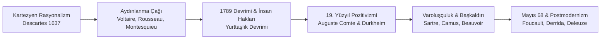

# 🇹🇷 🇫🇷 GSB Türkiye - Fransa Gençlik Değişimi 2026
### *Programme d'Échange de Jeunesse Türkiye - France 2026 & Grand Atlas Culturel de la France*

<div align="center">
  
</div>

> *"Le véritable voyage de découverte ne consiste pas à chercher de nouveaux paysages, mais à avoir de nouveaux yeux."*  
> — **Marcel Proust**, *À la recherche du temps perdu*  
> *(Asıl keşif yolculuğu yeni manzaralar aramak değil, yeni gözlere sahip olmaktır.)*

[](https://genclik.gov.tr)
[](#)
[](#)
[](LICENSE)

Bu açık kaynaklı depo; **T.C. Gençlik ve Spor Bakanlığı (GSB)** koordinasyonunda yürütülen **Türkiye - Fransa Gençlik Değişimi Programı 2026** kapsamında hazırlanmış saha seyir defterlerini, kamu diplomasisi müzakere raporlarını, kurumsal incelemeleri; ayrıca Fransa'nın felsefi, edebi, şiirsel, sanatsal, sinematografik, gastronomik, bilimsel, endüstriyel, coğrafi ve sosyolojik dokusunu ele alan ansiklopedik **Fransa Araştırma ve Kültür Atlası**nı içerir.

---

## 📑 Kapsamlı İçindekiler Tablosu

1. [📜 Büyük Fransız Düşünce ve Alıntılar Galerisi](#-büyük-fransız-düşünce-ve-alıntılar-galerisi)
2. [📖 Fransız Edebiyatının Büyük Çağları & Şiir Antolojisi](#-fransız-edebiyatının-büyük-çağları--şiir-antolojisi)
3. [🚶 Paris'te "Flâneur" Olmak ve Edebi Rotalar](#-pariste-flâneur-olmak-ve-edebi-rotalar)
4. [🎬 Fransız Sineması (*Le Septième Art*), Tiyatro & Müzik](#-fransız-sineması-le-septième-art-tiyatro--müzik)
5. [🍷 Fransız Gastronomisi, *Terroir* ve Peynir Haritası](#-fransız-gastronomisi-terroir-ve-peynir-haritası)
6. [🏛️ Fransa'nın Felsefi Temelleri & Fikir Tarihi](#️-fransanın-felsefi-temelleri--fikir-tarihi)
7. [⚖️ Devlet Mimarisi, Anayasal Düzen & "Laïcité"](#️-devlet-mimarisi-anayasal-düzen--laïcité)
8. [🗺️ Coğrafya ve 13 Metropoliten Bölge Atlası ("L'Hexagone")](#️-coğrafya-ve-13-metropoliten-bölge-atlası-lhexagone)
9. [🔬 Bilim, Yüksek Teknoloji, Nükleer & "La French Tech"](#-bilim-yüksek-teknoloji-nükleer--la-french-tech)
10. [🥐 Gündelik Yaşam Sosyolojisi: "L'art de vivre", Argot & Verlan](#-gündelik-yaşam-sosyolojisi-lart-de-vivre-argot--verlan)
11. [🤝 500 Yıllık Türkiye - Fransa İlişkileri & Frankofoni](#-500-yıllık-türkiye---fransa-ilişkileri--frankofoni)
12. [🗣️ Fransızca - Türkçe Diplomasi & Yaşam Sözlüğü](#️-fransızca---türkçe-diplomasi--yaşam-sözlüğü)
13. [⏳ Galya'dan 2026'ya Fransa Tarihsel Kronolojisi](#-galyadan-2026ya-fransa-tarihsel-kronolojisi)
14. [📅 2026 Değişim Programı Takvimi ve 5 Eylem Maddesi](#-2026-değişim-programı-takvimi-ve-5-eylem-maddesi)
15. [🧭 Depo Mimarisi ve Dosya Gezgini](#-depo-mimarisi-ve-dosya-gezgini)
16. [🌐 İnteraktif Portalı Çalıştırma](#-interaktif-portalı-çalıştırma)

---

## 📜 Büyük Fransız Düşünce ve Alıntılar Galerisi

Fransa'yı tanımak; felsefecilerinin akıl arayışını, şairlerinin hüznünü, yazarlarının toplum eleştirisini ve devlet adamlarının cumhuriyet tasavvurunu kavramakla başlar.

### 🏛️ Felsefe, Akıl ve Aydınlanma (*Les Lumières*)

> *"Cogito, ergo sum." (Je pense, donc je suis.)*  
> — **René Descartes**, *Discours de la méthode (1637)*  
> *(Düşünüyorum, öyleyse varım.)*

> *"Je ne suis pas d'accord avec ce que vous dites, mais je me battrai jusqu'à la mort pour que vous ayez le droit de le dire."*  
> — **Voltaire** *(François-Marie Arouet)*  
> *(Söylediklerinizle hemfikir değilim; ancak bunu söyleme hakkınızı sonuna kadar savunacağım.)*

> *"L'homme est né libre, et partout il est dans les fers."*  
> — **Jean-Jacques Rousseau**, *Du contrat social (1762)*  
> *(İnsan özgür doğar, oysa her yerde zincire vurulmuştur.)*

> *"Pour qu'on ne puisse abuser du pouvoir, il faut que, par la disposition des choses, le pouvoir arrête le pouvoir."*  
> — **Montesquieu**, *De l'esprit des lois (1748)*  
> *(İktidarın kötüye kullanılmasını önlemek için, işlerin öyle bir düzenlenmesi gerekir ki iktidar iktidarı durdurabilsin.)*

> *"Le cœur a ses raisons que la raison ne connaît point."*  
> — **Blaise Pascal**, *Pensées (1670)*  
> *(Gönlün, aklın hiç bilmediği öyle gerekçeleri vardır ki.)*

> *"Que sais-je ?"*  
> — **Michel de Montaigne**, *Les Essais (1580)*  
> *(Ben ne biliyorum ki? / Kuşkucu bilgeliğin kurucu sorusu)*

---

### 📚 Edebiyat, İnsan Ruhu ve Şiir

> *"Aimer, c'est savoir dire je t'aime sans parler."*  
> — **Victor Hugo**, *Les Misérables (1862)*  
> *(Sevmek, konuşmadan da 'seni seviyorum' diyebilmektir.)*

> *"Il faut être toujours ivre. Pour ne pas sentir l'horrible fardeau du Temps qui brise vos épaules et vous penche vers la terre, il faut vous enivrer sans trêve. De vin, de poésie ou de vertu, à votre guise."*  
> — **Charles Baudelaire**, *Petits poèmes en prose (1869)*  
> *(Her zaman sarhoş olmalı. Zamanın omuzlarınızı çökerten korkunç yükünü hissetmemek için... Durmaksızın sarhoş olun! Şarapla, şiirle ya da erdemle, nasıl dilerseniz.)*

> *"La vraie vie, la vie enfin découverte et éclaircie, la seule vie par conséquent réellement vécue, c'est la littérature."*  
> — **Marcel Proust**, *Le Temps retrouvé (1927)*  
> *(Gerçek yaşam, sonunda keşfedilen ve aydınlığa kavuşan, dolayısıyla gerçekten yaşanmış tek yaşam edebiyattır.)*

> *"On ne voit bien qu'avec le cœur. L'essentiel est invisible pour les yeux."*  
> — **Antoine de Saint-Exupéry**, *Le Petit Prince (1943)*  
> *(İnsan ancak yüreğiyle baktığı zaman doğruyu görebilir. Gerçeğin mayası gözle görülmez.)*

---

### ⚡ Varoluşçuluk, Başkaldırı ve Kadın Hakları

> *"L'existence précède l'essence."*  
> — **Jean-Paul Sartre**, *L'existentialisme est un humanisme (1946)*  
> *(Varoluş özden önce gelir.)*

> *"L'homme est condamné à être libre ; parce qu'une fois jeté dans le monde, il est responsable de tout ce qu'il fait."*  
> — **Jean-Paul Sartre**  
> *(İnsan özgür olmaya mahkûmdur; çünkü bir kez dünyaya atıldıktan sonra yaptığı her şeyden sorumludur.)*

> *"On ne naît pas femme : on le devient."*  
> — **Simone de Beauvoir**, *Le Deuxième Sexe (1949)*  
> *(Kadın doğulmaz, kadın olunur.)*

> *"Au milieu de l'hiver, j'ai découvert en moi un invincible été."*  
> — **Albert Camus**, *Retour à Tipasa (1952)*  
> *(Kışın tam ortasında, içimde yenilmez bir yaz olduğunu keşfettim.)*

> *"Je me révolte, donc nous sommes."*  
> — **Albert Camus**, *L'Homme révolté (1951)*  
> *(Başkaldırıyorum, öyleyse varız.)*

---

## 📖 Fransız Edebiyatının Büyük Çağları & Şiir Antolojisi

<div align="center">
  
</div>

Fransız edebiyatı, Orta Çağ şövalye destanlarından (*Chanson de Roland*) 21. yüzyıl çağdaş romanına kadar insanın evrensel dramını dile getirmiştir.

```text
[ 17. YY KLASİSİZM ] ➔ [ 18. YY AYDINLANMA ] ➔ [ 19. YY ROMANTİZM / REALİZM ] ➔ [ 19. YY SEMBOLİZM ] ➔ [ 20. YY VAROLUŞÇULUK ]
  (Molière, Racine)      (Voltaire, Rousseau)     (Hugo, Balzac, Flaubert, Zola)     (Baudelaire, Rimbaud)     (Sartre, Camus, Proust)
```

### 1. Şiir Seçkisi I: Charles Baudelaire — *L'Albatros* (Kötülük Çiçekleri, 1857)

```text
Souvent, pour s'amuser, les hommes d'équipage
Gagnent de grands oiseaux des mers, les albatros,
Qui suivent, indolents compagnons de voyage,
Le navire glissant sur les gouffres amers.

Le Poète est semblable au prince des nuées
Qui hante la tempête et se rit de l'archer ;
Exilé sur le sol au milieu des huées,
Ses ailes de géant l'empêchent de marcher.
```
> *(Eğlenmek için sık sık gemi tayfaları yakalar o koca deniz kuşlarını, albatrosları... Şair de tıpkı bu bulutlar prensine benzer: fırtınalarda uçan, okçularla alay eden; yuhalamalar ortasında yeryüzüne sürgün edilince, o devasa kanatları yürümesine engel olur.)*

---

### 2. Şiir Seçkisi II: Paul Verlaine — *Chanson d'automne* (Sonbahar Şarkısı, 1866)

```text
Les sanglots longs
Des violons
De l'automne
Blessent mon cœur
D'une langueur
Monotone.

Et je m'en vais
Au vent mauvais
Qui m'emporte
Deçà, delà,
Pareil à la
Feuille morte.
```
> *(Sonbahar kemanlarının uzun hıçkırıkları yaralar yüreğimi tekdüze bir uyuşuklukla... Ve çeker giderim beni oradan oraya savuran o uğursuz rüzgârda, tıpkı kuru bir yaprak gibi.)*

---

### 3. Şiir Seçkisi III: Paul Éluard — *Liberté* (Özgürlük, 1942 - Direniş Şiiri)

```text
Sur mes cahiers d'écolier
Sur mon pupitre et les arbres
Sur le sable sur la neige
J'écris ton nom

Et par le pouvoir d'un mot
Je recommence ma vie
Je suis né pour te connaître
Pour te nommer
Liberté.
```
> *(Okul defterlerimin üstüne / Sırama ve ağaçlara / Kuma ve kara / Yazarım adını... Ve bir tek sözcüğün gücüyle / Yeniden başlarım hayatıma / Seni tanımak için doğmuşum / Sana adını vermek için: ÖZGÜRLÜK.)*

---

## 🚶 Paris'te "Flâneur" Olmak ve Edebi Rotalar

*Flânerie*; hiçbir yere yetişme kaygısı gütmeden, kenti açık hava müzesi gibi seyretme ve kalabalıklar içinde tek başına kentin ruhunu dinleme felsefesidir (Baudelaire & Walter Benjamin).

### Paris'in 5 Büyük Edebi Yürüyüş Rotası:
1. **Saint-Germain-des-Prés:** *Café de Flore* & *Les Deux Magots* (Sartre, Simone de Beauvoir ve Camus'nün buluşma noktası).
2. **Quartier Latin & Panthéon:** 13. yüzyıldan beri bilimin kalbi Sorbonne, Shakespeare & Company kitapçısı ve Fransa'nın büyük evlatlarının yattığı Panthéon.
3. **Montmartre Tepesi:** Picasso'nun *Avignonlu Kızlar* tablosunu yaptığı *Le Bateau-Lavoir*, Sacré-Cœur ve bohem sanatçı sokakları.
4. **Seine Rıhtımları & Bouquinistes:** 16. yüzyıldan bu yana nehir boyunca sıralanan yeşil ahşap kutulu sahaf geleneği (UNESCO Mirası).
5. **Le Marais & Place des Vosges:** Victor Hugo'nun *Sefiller* romanını yazdığı tarihi evi (*Maison de Victor Hugo*).

---

## 🎬 Fransız Sineması (*Le Septième Art*), Tiyatro & Müzik

### 1. Yedinci Sanat: Lumière Kardeşlerden Nouvelle Vague'a
* **Sinemanın Doğuşu (1895):** Auguste ve Louis Lumière kardeşlerin Lyon'dan Paris'e getirdiği ilk hareketli görüntüler.
* **Yeni Dalga (*La Nouvelle Vague* - 1958):** Jean-Luc Godard (*À bout de souffle*), François Truffaut (*400 Darbe*), Agnès Varda. Stüdyo dekorları yerine Paris sokaklarında doğal ışıkla çekilen, atlamalı kurgulu (*jump cut*) auteur sineması.

### 2. Tiyatro: Comédie-Française'den Absürd Tiyatroya
* **Molière & Racine:** 1680'de kurulan dünyanın en eski devlet tiyatrosu *Comédie-Française*.
* **Uyumsuz / Saçma Tiyatrosu (*Théâtre de l'Absurde*):** Samuel Beckett (*Godot'yu Beklerken*) ve Eugène Ionesco (*Kel Şarkıcı, Gergedanlar*).

### 3. Müzik: La Chanson Française & French Touch
* **Chanson Ekolü:** Édith Piaf (*La Vie en rose*), Jacques Brel (*Ne me quitte pas*), Charles Aznavour (*La Bohème*), Serge Gainsbourg.
* **Elektronik Devrim (*French Touch*):** Daft Punk (*Discovery, Random Access Memories*), Justice, Air, Phoenix.

---

## 🍷 Fransız Gastronomisi, *Terroir* ve Peynir Haritası

<div align="center">
  
</div>

Fransız Gastronomi Yemeği, 2010 yılından bu yana **UNESCO Somut Olmayan Kültürel Mirası** listesindedir.

### 1. *Terroir* Felsefesi ve AOP Kalite Sistemi
*Terroir*; toprağın mineralleri, güneş açısı, mikro-klima ve nesiller boyu aktarılan insan ustalığının (*savoir-faire*) ürüne kattığı taklit edilemez kimliktir.

### 2. 1200+ Çeşit ve Büyük Peynir Aileleri:
* **Comté AOP (Bourgogne-Franche-Comté):** 6 ila 36 ay mağarada olgunlaştırılan sert, meyvemsi inek peyniri.
* **Roquefort AOP (Occitanie):** Combalou doğal kireçtaşı mağaralarında olgunlaşan çiğ koyun sütü mavi damarlı peynir.
* **Camembert de Normandie AOP (Normandie):** Kremsi dokulu, beyaz kadife kabuklu tarihi peynir.
* **Reblochon AOP (Alpler):** Yıkanmış kabuklu, fındıksı Alp peyniri (*Tartiflette* yemeğinin temeli).
* **Sainte-Maure de Touraine AOP (Loire Vadisi):** Ortasında meşe samanı çubuğu bulunan kül kaplı keçi peyniri (*Chèvre*).

### 3. Fırıncılık & Pastacılık (*Boulangerie & Pâtisserie*):
* **Geleneksel Baget (*Baguette de tradition*):** 2022 UNESCO Mirası. Yalnızca 4 malzeme (un, su, maya, tuz) ve katkısız uzun fermantasyon.
* **Kruvasan & Viennoiserie:** Kaliteli Fransız tereyağıyla kat kat lamine edilen çıtır hamurlar.
* **Klasikler:** Éclair, Paris-Brest, Mille-feuille, Tarte Tatin, Canelé de Bordeaux, Macaron.

---

## 🏛️ Fransa'nın Felsefi Temelleri & Fikir Tarihi



* **René Descartes (1596–1650):** Kartezyen şüphe ve akılcılık (*Discours de la méthode*).
* **Voltaire (1694–1778):** Dini hoşgörü ve düşünce özgürlüğü savunusu (*Traité sur la tolérance*).
* **Jean-Jacques Rousseau (1712–1778):** Halk egemenliği ve toplum sözleşmesi (*Du contrat social*).
* **Montesquieu (1689–1755):** Kuvvetler ayrılığı ilkesi (*De l'esprit des lois*).
* **1789 İnsan ve Yurttaş Hakları Bildirisi:** Evrensel eşitlik, masumiyet karinesi ve mülkiyet dokunulmazlığı.
* **Jean-Paul Sartre & Simone de Beauvoir & Albert Camus:** Varoluşçuluk, etik sorumluluk ve başkaldırı felsefesi.

---

## ⚖️ Devlet Mimarisi, Anayasal Düzen & "Laïcité"

### 1. Beşinci Cumhuriyet (*La Ve République* - 1958)
* **Cumhurbaşkanı (*Président* - Élysée):** 5 yıllık süreyle doğrudan halk tarafından seçilir. Dış politika, nükleer caydırıcılık ve silahlı kuvvetlerin başıdır; meclisi feshedebilir.
* **Başbakan ve Hükûmet (*Matignon*):** Kanun tasarılarını hazırlar, idareyi yürütür; meclis çoğunluğuna dayanır.
* **Çift Meclis:** 577 üyeli Ulusal Meclis (*Assemblée Nationale*) ve 348 üyeli Senato (*Sénat*).
* **Conseil Constitutionnel (Anayasa Konseyi) & Conseil d'État (Danıştay):** Norm denetimi ve yüksek idari yargı.

### 2. Laiklik İlkesi (*Laïcité* - 9 Aralık 1905 Yasası)
* **Devletin Mutlak Tarafsızlığı (*Neutralité de l'État*):** Devlet hiçbir inancı tanımaz, maaşa bağlamaz, finanse etmez.
* **Vicdan Özgürlüğü:** İnanma ve inanmama hakkı eşit korunur.
* **Kamusal Alanda Nötrlük:** Kamu görevlileri tarafsızdır; okullar cumhuriyetçi tarafsız aklın geliştiği alanlardır.

---

## 🗺️ Coğrafya ve 13 Metropoliten Bölge Atlası ("L'Hexagone")

<div align="center">
  
</div>

Fransa anakarası, 6 köşeli geometrisi sebebiyle **"L'Hexagone" (Altıgen)** olarak anılır. 643.801 km² yüzölçümüyle AB'nin en geniş toprağına sahiptir.

```text
                                [ HAUTS-DE-FRANCE ]
                                   (Lille, Amiens)
               [ NORMANDIE ]                              [ GRAND EST ]
              (Rouen, Le Havre)    [ ÎLE-DE-FRANCE ]    (Strasbourg, Reims)
   [ BRETAGNE ]                        (Paris)
 (Rennes, Brest)       [ CENTRE-VAL DE LOIRE ]    [ BOURGOGNE-FRANCHE-COMTÉ ]
                           (Orléans, Tours)             (Dijon, Besançon)
  [ PAYS DE LA LOIRE ]
    (Nantes, Angers)                                [ AUVERGNE-RHÔNE-ALPES ]
                                                          (Lyon, Grenoble)
            [ NOUVELLE-AQUITAINE ]
              (Bordeaux, Limoges)       [ OCCITANIE ]            [ PACA ]
                                    (Toulouse, Montpellier)  (Marseille, Nice)
                                                                [ CORSE ]
                                                                (Ajaccio)
```

| Bölge (*Région*) | Nüfus | Merkez Şehirler | Temel Kimlik & Sektörler |
| :--- | :--- | :--- | :--- |
| **Île-de-France** | 12.4M | Paris, Versailles | Diplomasi, Sorbonne, Louvre, Station F, La Défense. GSYİH'nin %31'i. |
| **Auvergne-Rhône-Alpes** | 8.1M | Lyon, Grenoble, Annecy | Gastronomi başkenti Lyon, Mont Blanc (4808 m), nanoteknoloji, nükleer. |
| **PACA** | 5.1M | Marseille, Nice, Cannes | Akdeniz limanı Marseille, Fransız Rivierası, Greko-Romen kalıntıları. |
| **Occitanie** | 6.0M | Toulouse, Montpellier | Avrupa havacılık üssü Airbus, CNES uzay ajansı, Carcassonne kalesi. |
| **Nouvelle-Aquitaine** | 6.0M | Bordeaux, Limoges | Dünya şarap başkenti Bordeaux, Atlantik kıyıları, Dassault havacılık. |
| **Grand Est** | 5.5M | Strasbourg, Reims, Metz | Avrupa Parlamentosu & AİHM kenti Strasbourg, Şampanya bağları. |
| **Hauts-de-France** | 6.0M | Lille, Amiens, Calais | Manş Tüneli (İngiltere kapısı), Batarya Vadisi (*Battery Valley*). |
| **Normandie** | 3.3M | Rouen, Caen, Le Havre | 1944 D-Day Çıkarma Sahilleri, Empresyonizm, Mont-Saint-Michel. |
| **Bretagne** | 3.4M | Rennes, Brest | Kelt mirası, Breton dili, Atlantik Donanma Üssü, siber güvenlik. |
| **Bourgogne-Franche-Comté** | 2.8M | Dijon, Besançon, Belfort | Burgonya şarapları, Besançon ince saat mekaniği, Alstom TGV fabrikaları. |
| **Centre-Val de Loire** | 2.6M | Orléans, Tours | UNESCO Loire Şatoları (Chambord, Chenonceau), Kozmetik Vadisi. |
| **Pays de la Loire** | 3.8M | Nantes, Saint-Nazaire | Dünyanın en büyük yolcu gemisi tersaneleri, Jules Verne şehri Nantes. |
| **Corse (Korsika)** | 350K | Ajaccio, Bastia | Dağlık Akdeniz adası, Napoléon'un doğum yeri, Korsika dili. |

---

## 🔬 Bilim, Yüksek Teknoloji, Nükleer & "La French Tech"

<div align="center">
  
</div>

* **Nükleer Enerji Modeli (*Messmer Planı*):** 56 ticari reaktör ile elektriğin ~%70'ini nükleerden karşılar (~50g CO2/kWh emisyon). ITER nükleer füzyon araştırma reaktörüne ev sahipliği yapar (Cadarache).
* **Havacılık & Uzay:** Toulouse merkezli **Airbus**, Fransız Guyanası Kourou Uzay Limanı'ndan fırlatılan **Ariane 6** roketleri, Dassault Aviation (*Rafale* savaş uçakları), Safran motorları.
* **Raylı Sistemler (TGV - Alstom):** 1981'den bu yana raylı sistemlerde dünya lideri. Modifiye TGV V150 treni **574,8 km/s** hızla dünya ray hız rekorunu elinde tutmaktadır.
* **Girişimcilik ve Yapay Zekâ (*La French Tech*):** Paris merkezli dünyanın en büyük startup kampüsü **Station F** (34.000 m²). Avrupa'nın açık kaynak yapay zekâ öncüsü **Mistral AI**, Doctolib, BlaBlaCar, INRIA ve CNRS.

---

## 🥐 Gündelik Yaşam Sosyolojisi: "L'art de vivre", Argot & Verlan

### 1. Yaşama Sanatı (*L'art de vivre*)
* **Öğle ve Akşam Sofrası:** Yemeği aceleye getirmeyen, dostlarla sohbeti merkeze alan ritüel.
* **Kafe Terası:** Kaldırıma bakan masalarda kitap okuma, insanları izleme (*observer les passants*) ve gazete tarama kültürü.

### 2. Yaşayan Sokak Dili: Verlan ve Argot
Fransız gençliğinin ve sokak kültürünün dinamik dil yapısı:
* **Verlan (*L'envers* - Heceleri Ters Çevirme):**
  * *Femme* ➔ **Meuf** (Kadın / Kız arkadaş)
  * *Fou* ➔ **Ouf** (Çılgın / C'est un truc de ouf!)
  * *Bizarre* ➔ **Zarbi** (Tuhaf)
  * *Merci* ➔ **Cimer** (Sağ ol)
  * *Laisse tomber* ➔ **Laisse béton** (Boşver)
* **Argot Terimleri:**
  * *Le boulot / Le taf:* İş, çalışma
  * *Bouffer:* Yemek yemek
  * *Un pote:* Kanka, yakın dost
  * *Kiffer:* Çok sevmek (*Je kiffe trop*)
  * *Avoir le seum:* Sinir olmak, bozulmak

---

## 🤝 500 Yıllık Türkiye - Fransa İlişkileri & Frankofoni

* **1536 İttifakı:** Kanuni Sultan Süleyman ile Fransa Kralı I. François arasındaki tarihi diplomatik ve askeri ittifak; İstanbul'da açılan ilk daimi Fransız elçiliği (Jean de La Forêt).
* **Aydınlanma ve Tanzimat:** Şinasi, Namık Kemal ve Jön Türklerin Paris'teki entelektüel temasları; Fransız idare hukuku ve belediyeciliğinin Türkiye'ye aktarımı.
* **Eğitim Köprüsü:** 1868'de kurulan **Galatasaray Lisesi** (*Mekteb-i Sultani*) ve 1992 Türkiye-Fransa Hükümetlerarası Anlaşması ile kurulan **Galatasaray Üniversitesi**.
* **Türkçede Yaşayan 5000+ Fransızca Kökenli Kelime:** Televizyon, Gar, Abajur, Kuaför, Şoför, Pantolon, Viraj, Randevu, Asansör, Bisküvi, Şofben, Plaj, Koridor, Balkon, Kolye vb.

---

## 🗣️ Fransızca - Türkçe Diplomasi & Yaşam Sözlüğü

| Fransızca Terim / İfade | Telaffuz | Türkçe Karşılığı | Alan |
| :--- | :--- | :--- | :--- |
| **La diplomatie publique** | *la di-plo-ma-si pü-blik* | Kamu diplomasisi | Diplomasi |
| **L'engagement citoyen (m)** | *lan-gaj-man si-twa-yan* | Yurttaşlık katılımı / Gönüllülük | Diplomasi |
| **Le développement durable** | *lö dev-lop-man dü-rabl* | Sürdürülebilir kalkınma | Çevre / Politika |
| **La table ronde** | *la tabl rond* | Yuvarlak masa toplantısı | Diplomasi |
| **Le compte-rendu** | *lö kont-ran-dü* | Toplantı tutanağı / Rapor | Diplomasi |
| **Bonjour / Bonsoir** | *bon-jur / bon-swar* | İyi günler / İyi akşamlar | Günlük Yaşam |
| **S'il vous plaît** | *sil vu ple* | Lütfen (Resmi) | Günlük Yaşam |
| **Je vous en prie** | *jö vu zan pri* | Rica ederim | Günlük Yaşam |
| **L'addition, s'il vous plaît** | *la-di-syon sil vu ple* | Hesap lütfen | Seyahat / Kafe |
| **Où se trouve la gare ?** | *u sö truv la gar* | Gar nerede bulunuyor? | Seyahat |
| **C'est un truc de ouf !** | *se tün trük dö uf* | Çılgınca / İnanılmaz bir şey! | Argot / Verlan |
| **Un pote / Une pote** | *ön pot* | Kanka / Yakın arkadaş | Argot |
| **Poser un lapin** | *po-ze ön la-pen* | Randevuya gelmemek, ekmek | Deyim |
| **Avoir le coup de foudre** | *a-vwar lö ku dö fudr* | İlk görüşte aşık olmak / vurulmak | Deyim |

---

## ⏳ Galya'dan 2026'ya Fransa Tarihsel Kronolojisi

```text
M.Ö. 52   ──> Alesia Kuşatması: Jül Sezar & Vercingétorix (Galya'nın Roma'ya Katılışı)
486       ──> Frank Krallığı: I. Clovis'in Hristiyanlığı Kabulü ve Merovenj Hanedanı
800       ──> Şarlman'ın (Charlemagne) Kutsal Roma İmparatoru Olarak Taç Giymesi
1536      ──> Kanuni Sultan Süleyman & I. François Osmanlı-Fransız İttifakı
1661-1715 ──> XIV. Louis (Güneş Kral) & Versailles Sarayı'nda Mutlak Monarşinin Zirvesi
1789      ──> 14 Temmuz Bastille Baskını & İnsan ve Yurttaş Hakları Bildirisi
1804      ──> I. Napoléon Bonaparte'ın İmparatorluk İlanı ve Medeni Kanun (Code Civil)
1871      ──> Paris Komünü (Dünyanın ilk işçi özyönetimi) & III. Cumhuriyetin Kuruluşu
1905      ──> 9 Aralık Laïcité Kanunu (Kilise ile Devlet İşlerinin Kesin Ayrılması)
1944      ──> Normandiya Çıkarması (D-Day), Paris'in Kurtuluşu ve Kadınlara Oy Hakkı
1958      ──> General Charles de Gaulle Önderliğinde V. Cumhuriyet Anayasası
1968      ──> Mayıs 68 Olayları: Üniversite Boykotları ve 10 Milyonluk Genel Grev
1981      ──> İlk TGV Yüksek Hızlı Tren Hattının Açılışı (Paris - Lyon)
2026      ──> GSB Türkiye - Fransa Gençlik Değişimi Programı & İkili Eylem Planı
```

---

## 📅 2026 Değişim Programı Takvimi ve 5 Eylem Maddesi

| Aşama | Tarih / Konum | Odak Alanı & Temel Faaliyetler | Durum |
| :--- | :--- | :--- | :---: |
| **I. Hazırlık** | Ankara / Çevrim içi | Heyet seçimi, diplomatik brifingler, dil ve kültür atölyeleri | 🟢 Tamamlandı |
| **II. Türkiye Etabı** | Ankara & İstanbul | Anıtkabir, GSB Bakanlığı, Altındağ GM, Galatasaray Lisesi, Ortak Çalıştaylar | 🟢 Tamamlandı |
| **III. Fransa Etabı** | Paris & Lyon | Fransız Bakanlığı, MJC Ağı, Station F, UNESCO, Vieux Lyon İpekçilik İncelemesi | 🟢 Tamamlandı |
| **IV. Çıktı & Yayın** | Açık Kaynak / Web | Kapsamlı Kültür Atlası, Ortak Bildiri, İki Dilli Web Portalı ve Eylem Planı | 🟢 Yayında |

### 🎯 2026–2027 Ortak Eylem Maddeleri:
1. **ACT-01:** Türkiye-Fransa Yıllık Gençlik Forumu (Ankara & Paris).
2. **ACT-02:** 10 Kardeş Gençlik Merkezi Eşleştirmesi (GSB Gençlik Merkezleri & MJC Ağı).
3. **ACT-03:** Yeşil Şehircilik ve İklim Hackathonu (Station F & Teknoparklar).
4. **ACT-04:** İki Dilli Dijital Gençlik Medya Platformu ve Podcast Serisi.
5. **ACT-05:** Karşılıklı Gönüllülük Değişimi (*Service Civique* & GSB Gönüllülük Ağı).

---

## 🧭 Depo Mimarisi ve Dosya Gezgini

```text
gsb-france-exchange-2026/
├── assets/                                # 🖼️ Görsel Varlıklar ve Bannerlar
│   └── images/
│       ├── banner-hero-diplomacy.jpg      # 🇹🇷 🇫🇷 Gençlik Diplomasisi & İstanbul-Paris Köprüsü
│       ├── banner-literature-philosophy.jpg# 📚 Edebiyat, Felsefe ve Saint-Germain Masası
│       ├── banner-regions-geography.jpg   # 🗺️ Fransa Coğrafyası (Lavanta, Şato, Alpler, TGV)
│       ├── banner-gastronomy-terroir.jpg  # 🍷 Gastronomi, AOP Peynirleri, Şarap & Baget
│       └── banner-science-tech.jpg        # 🔬 Airbus, Ariane 6, TGV ve Station F
│
├── README.md                              # 📘 Kapsamlı Başvuru Kılavuzu & Kültür Atlası
├── index.html                             # 🌐 İnteraktif Web Portalı ve Dijital Atlas
├── style.css                              # 🎨 Modern Portal Arayüz Stilleri (Glassmorphism)
├── app.js                                 # ⚡ Dinamik Arama, Flashcard & 10 Soruluk Quiz Motoru
│
├── france-atlas/                          # 📚 Kapsamlı Fransa Araştırma Atlası
│   ├── french-poetry-anthology.md         # 📜 Baudelaire, Rimbaud, Verlaine, Éluard, Prévert
│   ├── gastronomy-terroir-guide.md        # 🍷 Terroir, Peynirler, Şaraplar, Baget & Michelin
│   ├── cinema-theatre-music.md            # 🎬 Nouvelle Vague, Absürd Tiyatro, Chanson & Daft Punk
│   ├── paris-flaneur-guide.md             # 🚶 Flânerie Felsefesi, Edebi Rotalar ve Bouquinistes
│   ├── history-thought.md                 # 🏛️ Aydınlanma, Devrimler, Varoluşçuluk ve Mayıs 68
│   ├── institutions-state.md              # ⚖️ 5. Cumhuriyet, Yarı-Başkanlık, Laïcité ve MJC Modeli
│   ├── geography-regions.md               # 🗺️ "L'Hexagone", 13 Metropoliten Bölge ve Şehir Atlası
│   ├── arts-literature.md                 # 🎨 Edebiyat, Flânerie, Empresyonizm ve Gotik Mimari
│   ├── science-industry.md                # 🔬 Nükleer Enerji, Airbus/Uzay, TGV ve French Tech
│   ├── everyday-culture.md                # 🥐 Art de Vivre, Gastronomi, Argot ve Verlan
│   └── vocabulary-guide.md                # 🗣️ Diplomasi, Müzakere ve Günlük Fransızca Kılavuzu
│
├── workshops/                             # 🏛️ Tematik Gençlik Çalıştayları ve Müzakereler
│   ├── youth-diplomacy.md                 # 🌐 Kamu Diplomasisi ve Türkiye-Fransa İkili İlişkileri
│   ├── intercultural-dialogue.md          # 🌍 Kültürlerarası İletişim ve Tarihsel Köprüler
│   ├── sustainability-green-transition.md # 🌱 Yeşil Dönüşüm ve Ekolojik İnisiyatifler
│   └── civic-engagement-volunteering.md   # 🤝 Service Civique ve GSB Gönüllülük Modeli
│
├── diary/                                 # ✍️ Saha Seyir Defteri ve Günlükler
│   ├── stage-turkey/                      # 🇹🇷 Türkiye Etabı Günlükleri (Ankara & İstanbul)
│   │   ├── day-01-welcome-ankara.md
│   │   ├── day-02-youth-policy-workshop.md
│   │   ├── day-03-istanbul-historical-dialogue.md
│   │   └── day-04-bilateral-action-plans.md
│   └── stage-france/                      # 🇫🇷 Fransa Etabı Günlükleri (Paris & Lyon)
│       ├── day-01-arrival-paris.md
│       ├── day-02-institutions-visit.md
│       ├── day-03-unesco-multilateral-diplomacy.md
│       └── day-04-regional-engagement-lyon.md
│
└── presentations/                         # 📊 Sunumlar ve Politika Belgeleri
    ├── turkey-cultural-presentation.md   # 🇹🇷 Fransa Heyetine Yönelik Türkiye Sunumu
    └── youth-action-plan-2026.md         # 📜 2026-2027 Ortak Eylem Planı & Politika Raporu
```

---

## 🌐 İnteraktif Portalı Çalıştırma

Bu depoda yer alan modern, responsive ve dinamik web portalını çalıştırmak için:

```bash
# Seçenek 1: Python ile yerel sunucu başlatma
python -m http.server 8000

# Seçenek 2: Node.js / npx ile çalıştırma
npx serve .

# Ardından tarayıcınızda açın:
http://localhost:8000
```

Portal Özellikleri:
* 🗺️ **13 Fransa Bölgesi İnteraktif Filtreleme ve Arama**
* ⚡ **3D Çevrilebilir Fransızca - Türkçe Flashcard Sistemi**
* 📖 **Kapsamlı Arama Yapılabilir Diplomasi Sözlüğü**
* 🧠 **10 Soruluk Anında Puanlamalı Kültürel Diplomasi Quiz Modülü**
* 📜 **Modallar Aracılığıyla Tüm Atlas Dosyalarını Tarayıcıda Okuma**

---

<div align="center">
  <sub>🇹🇷 T.C. Gençlik ve Spor Bakanlığı (GSB) • 🇫🇷 République Française Jeunesse et Sports</sub><br>
  <sub><b>GSB France-Türkiye Youth Exchange 2026</b> — <i>Açık Kaynak Kültürel Diplomasi ve Gençlik Atlası</i></sub>
</div>