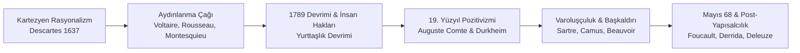

# 🇹🇷 🇫🇷 GSB Türkiye - Fransa Gençlik Değişimi 2026
### *Programme d'Échange de Jeunesse Türkiye - France 2026 & Grand Atlas Culturel de la France*

> *"Le véritable voyage de découverte ne consiste pas à chercher de nouveaux paysages, mais à avoir de nouveaux yeux."*  
> — **Marcel Proust**, *À la recherche du temps perdu*  
> *(Asıl keşif yolculuğu yeni manzaralar aramak değil, yeni gözlere sahip olmaktır.)*

[](https://genclik.gov.tr)
[](https://github.com/arch-yunus/gsb-france-exchange-2026)
[](#)
[](LICENSE)

Bu açık kaynaklı depo; **T.C. Gençlik ve Spor Bakanlığı (GSB)** koordinasyonunda yürütülen **Türkiye - Fransa Gençlik Değişimi Programı 2026** kapsamında hazırlanmış saha seyir defterlerini, gençlik diplomasisi müzakere raporlarını, kurumsal incelemeleri ve Fransa'nın felsefi, siyasi, edebi, bilimsel, endüstriyel, coğrafi ve sosyolojik katmanlarını ele alan ansiklopedik **Fransa Araştırma ve Kültür Atlası**nı içerir.

---

## 📑 İçindekiler Tablosu

1. [📜 Büyük Fransız Düşünce ve Alıntılar Antolojisi](#-büyük-fransız-düşünce-ve-alıntılar-antolojisi)
2. [🧭 Depo Mimarisi ve Dosya Gezgini](#-depo-mimarisi-ve-dosya-gezgini)
3. [🏛️ Fransa'nın Felsefi Temelleri & Fikir Tarihi](#️-fransanın-felsefi-temelleri--fikir-tarihi)
4. [⚖️ Devlet Mimarisi, Anayasal Yapı & "Laïcité"](#️-devlet-mimarisi-anayasal-yapı--laïcité)
5. [🗺️ Coğrafya ve 13 Metropoliten Bölge Atlası ("L'Hexagone")](#️-coğrafya-ve-13-metropoliten-bölge-atlası-lhexagone)
6. [🎨 Edebiyat, Sanat, Sinema & Müzik Mirası](#-edebiyat-sanat-sinema--müzik-mirası)
7. [🔬 Bilim, Yüksek Teknoloji, Nükleer & "La French Tech"](#-bilim-yüksek-teknoloji-nükleer--la-french-tech)
8. [🥐 Gündelik Yaşam Sosyolojisi: "L'art de vivre", Argot & Verlan](#-gündelik-yaşam-sosyolojisi-lart-de-vivre-argot--verlan)
9. [🤝 500 Yıllık Türkiye - Fransa İlişkileri & Frankofoni](#-500-yıllık-türkiye---fransa-ilişkileri--frankofoni)
10. [🗣️ Temel Fransızca - Türkçe Diplomasi & Yaşam Sözlüğü](#️-temel-fransızca---türkçe-diplomasi--yaşam-sözlüğü)
11. [⏳ Galya'dan 2026'ya Fransa Tarihsel Kronolojisi](#-galyadan-2026ya-fransa-tarihsel-kronolojisi)
12. [📅 2026 Değişim Programı Takvimi ve Eylem Planı](#-2026-değişim-programı-takvimi-ve-eylem-planı)
13. [🌐 İnteraktif Portalı Çalıştırma](#-interaktif-portalı-çalıştırma)

---

## 📜 Büyük Fransız Düşünce ve Alıntılar Antolojisi

Fransa'yı tanımak; felsefecilerinin ahlak arayışını, yazarlarının toplum eleştirisini, şairlerinin melankolisini ve bilim insanlarının hakikat tutkusunu anlamakla başlar.

### 🏛️ Felsefe, Akıl ve Aydınlanma (*Les Lumières*)

> *"Cogito, ergo sum." (Je pense, donc je suis.)*  
> — **René Descartes**, *Discours de la méthode (1637)*  
> *(Düşünüyorum, öyleyse varım.)*

> *"Je ne suis pas d'accord avec ce que vous dites, mais je me battrai jusqu'à la mort pour que vous ayez le droit de le dire."*  
> — **Voltaire** *(François-Marie Arouet)*  
> *(Söylediklerinizle hemfikir değilim; ancak bunu söyleme hakkınızı sonuna kadar savunacağım.)*

> *"L'homme est né libre, et partout il est dans les fers."*  
> — **Jean-Jacques Rousseau**, *Du contrat social (1762)*  
> *(İnsan özgür doğar, oysa her yerde zincire vurulmuştur.)*

> *"Pour qu'on ne puisse abuser du pouvoir, il faut que, par la disposition des choses, le pouvoir arrête le pouvoir."*  
> — **Montesquieu**, *De l'esprit des lois (1748)*  
> *(İktidarın kötüye kullanılmasını önlemek için, işlerin öyle bir düzenlenmesi gerekir ki iktidar iktidarı durdurabilsin.)*

> *"Le cœur a ses raisons que la raison ne connaît point."*  
> — **Blaise Pascal**, *Pensées (1670)*  
> *(Gönlün, aklın hiç bilmediği öyle gerekçeleri vardır ki.)*

> *"Que sais-je ?"*  
> — **Michel de Montaigne**, *Les Essais (1580)*  
> *(Ben ne biliyorum ki? / Şüpheci bilgeliğin temeli)*

---

### 📚 Edebiyat, İnsan Ruhu ve Şiir

> *"Aimer, c'est savoir dire je t'aime sans parler."*  
> — **Victor Hugo**, *Les Misérables (1862)*  
> *(Sevmek, konuşmadan da 'seni seviyorum' diyebilmektir.)*

> *"Tant qu'il existera, par le fait des lois et des mœurs, une damnation sociale... des livres de la nature de celui-ci pourront ne pas être inutiles."*  
> — **Victor Hugo**, *Les Misérables Önsözü*  
> *(Yasalar ve töreler yüzünden toplumsal bir lanetlenme var oldukça... bu tür kitaplar faydasız olmayacaktır.)*

> *"Il n'y a pas de fin à l'art. On ne fait que s'approcher."*  
> — **Gustave Flaubert**  
> *(Sanatın sonu yoktur. Ona sadece yaklaşılabilir.)*

> *"Madame Bovary, c'est moi !"*  
> — **Gustave Flaubert**  
> *(Madam Bovary benim!)*

> *"Il faut être toujours ivre. Pour ne pas sentir l'horrible fardeau du Temps qui brise vos épaules... Enivrez-vous sans cesse ! De vin, de poésie ou de vertu, à votre guise."*  
> — **Charles Baudelaire**, *Petits poèmes en prose (1869)*  
> *(Her zaman sarhoş olmalı. Zamanın omuzlarınızı çökerten korkunç yükünü hissetmemek için... Durmaksızın sarhoş olun! Şarapla, şiirle ya da erdemle, nasıl dilerseniz.)*

> *"La vraie vie, la vie enfin découverte et éclaircie, la seule vie par conséquent réellement vécue, c'est la littérature."*  
> — **Marcel Proust**, *Le Temps retrouvé (1927)*  
> *(Gerçek yaşam, sonunda keşfedilen ve aydınlığa kavuşan, dolayısıyla gerçekten yaşanmış tek yaşam edebiyattır.)*

> *"On ne voit bien qu'avec le cœur. L'essentiel est invisible pour les yeux."*  
> — **Antoine de Saint-Exupéry**, *Le Petit Prince (1943)*  
> *(İnsan ancak yüreğiyle baktığı zaman doğruyu görebilir. Gerçeğin mayası gözle görülmez.)*

---

### ⚡ Varoluşçuluk, Başkaldırı ve 20. Yüzyıl

> *"L'existence précède l'essence."*  
> — **Jean-Paul Sartre**, *L'existentialisme est un humanisme (1946)*  
> *(Varoluş özden önce gelir.)*

> *"L'homme est condamné à être libre."*  
> — **Jean-Paul Sartre**  
> *(İnsan özgür olmaya mahkûmdur.)*

> *"On ne naît pas femme : on le devient."*  
> — **Simone de Beauvoir**, *Le Deuxième Sexe (1949)*  
> *(Kadın doğulmaz, kadın olunur.)*

> *"Au milieu de l'hiver, j'ai découvert en moi un invincible été."*  
> — **Albert Camus**, *Retour à Tipasa (1952)*  
> *(Kışın tam ortasında, içimde yenilmez bir yaz olduğunu keşfettim.)*

> *"Je me révolte, donc nous sommes."*  
> — **Albert Camus**, *L'Homme révolté (1951)*  
> *(Başkaldırıyorum, öyleyse varız.)*

---

### 🔬 Bilim, Doğa ve Sanayi

> *"Rien ne se perd, rien ne se crée, tout se transforme."*  
> — **Antoine Lavoisier** *(Modern Kimyanın Kurucusu)*  
> *(Hiçbir şey kaybolmaz, hiçbir şey yoktan var olmaz; her şey dönüşür.)*

> *"Dans les champs de l'observation, le hasard ne favorise que les esprits préparés."*  
> — **Louis Pasteur**  
> *(Gözlem alanında şans, yalnızca hazırlıklı zihinlerin yanındadır.)*

> *"Dans la vie, rien n'est à craindre, tout est à comprendre. C'est le moment de comprendre plus, pour avoir moins peur."*  
> — **Marie Curie** *(İki Nobel Ödüllü Fizikçi & Kimyager)*  
> *(Hayatta hiçbir şeyden korkmamalı, her şey anlaşılmalıdır. Şimdi daha az korkmak için daha çok anlama zamanıdır.)*

---

### 🏛️ Siyaset, Cumhuriyet ve Diplomasi

> *"Liberté, Égalité, Fraternité"*  
> — **Devise de la République française**  
> *(Özgürlük, Eşitlik, Kardeşlik)*

> *"La France ne peut être la France sans la grandeur."*  
> — **Charles de Gaulle**, *Mémoires de guerre (1954)*  
> *(Fransa, büyüklük olmadan Fransa olamaz.)*

> *"Le courage, c'est de chercher la vérité et de la dire ; c'est de ne pas subir la loi du mensonge triomphant."*  
> — **Jean Jaurès** *(Fransız Sosyalist Düşünür & Barış Savunucusu)*  
> *(Cesaret; hakikati aramak ve onu söylemektir; zafer kazanmış yalanın yasasına boyun eğmemektir.)*

> *"L'Europe ne se fera pas d'un coup, ni dans une construction d'ensemble : elle se fera par des réalisations concrètes créant d'abord une solidarité de fait."*  
> — **Robert Schuman**, *Déclaration du 9 mai 1950*  
> *(Avrupa bir anda ya da tek bir planla inşa edilmeyecektir: her şeyden önce fiili bir dayanışma yaratan somut kazanımlarla kurulacaktır.)*

---

## 🧭 Depo Mimarisi ve Dosya Gezgini

```text
gsb-france-exchange-2026/
├── README.md                    # 📘 Kapsamlı Başvuru Kılavuzu & Kültür Atlası
├── index.html                   # 🌐 İnteraktif Web Portalı ve Dijital Atlas
├── style.css                    # 🎨 Modern Portal Arayüz Stilleri (Glassmorphism & Responsive)
├── app.js                       # ⚡ Dinamik Arama, Flashcard & 10 Soruluk Quiz Motoru
│
├── france-atlas/                # 📚 Kapsamlı Fransa Araştırma Atlası
│   ├── history-thought.md       # Aydınlanma, Devrimler, Varoluşçuluk ve Mayıs 68
│   ├── institutions-state.md    # 5. Cumhuriyet, Yarı-Başkanlık, Laïcité ve MJC Modeli
│   ├── geography-regions.md     # "L'Hexagone", 13 Metropoliten Bölge ve Şehir Atlası
│   ├── arts-literature.md       # Edebiyat, Flânerie, Empresyonizm ve Nouvelle Vague
│   ├── science-industry.md      # Nükleer Enerji, Airbus/Uzay, TGV ve French Tech
│   ├── everyday-culture.md      # Art de Vivre, Gastronomi, Argot ve Verlan
│   └── vocabulary-guide.md      # Diplomasi, Müzakere ve Günlük Fransızca Kılavuzu
│
├── workshops/                   # 🏛️ Tematik Gençlik Çalıştayları ve Müzakereler
│   ├── youth-diplomacy.md       # Kamu Diplomasisi ve Türkiye-Fransa İkili İlişkileri
│   ├── intercultural-dialogue.md# Kültürlerarası İletişim ve Tarihsel Köprüler
│   ├── sustainability-green-transition.md # Yeşil Dönüşüm ve Ekolojik İnisiyatifler
│   └── civic-engagement-volunteering.md   # Service Civique ve GSB Gönüllülük Modeli
│
├── diary/                       # ✍️ Saha Seyir Defteri ve Günlükler
│   ├── stage-turkey/            # Türkiye Etabı Günlükleri (Ankara & İstanbul)
│   │   ├── day-01-welcome-ankara.md
│   │   ├── day-02-youth-policy-workshop.md
│   │   ├── day-03-istanbul-historical-dialogue.md
│   │   └── day-04-bilateral-action-plans.md
│   └── stage-france/            # Fransa Etabı Günlükleri (Paris & Lyon)
│       ├── day-01-arrival-paris.md
│       ├── day-02-institutions-visit.md
│       ├── day-03-unesco-multilateral-diplomacy.md
│       └── day-04-regional-engagement-lyon.md
│
└── presentations/               # 📊 Sunumlar ve Politika Belgeleri
    ├── turkey-cultural-presentation.md # Fransa Heyetine Yönelik Türkiye Sunumu
    └── youth-action-plan-2026.md       # 2026-2027 Ortak Eylem Planı & Politika Raporu
```

---

## 🏛️ Fransa'nın Felsefi Temelleri & Fikir Tarihi

Fransa düşüncesi, yalnızca ulusal bir gelenek değil; modern dünyada hukukun üstünlüğü, evrensel insan hakları, kamusal akıl ve bireysel özgürlük normlarını kuran küresel bir meşaledir.



### 1. Rasyonalizmin Doğuşu: René Descartes
17. yüzyılda René Descartes, *Discours de la méthode* (1637) eseriyle skolastik dogmaları yıkarak felsefenin merkezine düşünen özneyi yerleştirdi. Kartezyen şüphe, bilginin mutlak temelini arama aracı olarak kullanıldı ve modern bilimsel metodolojinin temeli atıldı.

### 2. Aydınlanma Çağı (*Les Lumières* - 18. Yüzyıl)
* **Voltaire:** Bağnazlık, dini fanatizm ve sansürle mücadele etti; hoşgörünün ve rasyonel eleştirinin bayraktarlığını yaptı.
* **Jean-Jacques Rousseau:** *Du contrat social* (1762) ile kralların ilahi hakkına karşı "Halk Egemenliği" ve "Toplum Sözleşmesi" kavramlarını kurdu.
* **Montesquieu:** *De l'esprit des lois* (1748) eserinde tiranlığı engellemenin tek yolunun yasama, yürütme ve yargının ayrılması (Kuvvetler Ayrılığı) olduğunu ilan etti.
* **Diderot & d'Alembert:** 28 ciltlik devasa *L'Encyclopédie* ile bilgiyi kilise tekelinden çıkarıp kamuya açtılar.

### 3. 1789 Fransız İhtilali ve İnsan Hakları
26 Ağustos 1789 tarihli **İnsan ve Yurttaş Hakları Bildirisi** (*Déclaration des droits de l'homme et du citoyen*); insanların özgür ve eşit doğduğunu, egemenliğin millete ait olduğunu ve vicdan özgürlüğünün dokunulmazlığını anayasal güvenceye bağladı.

### 4. 20. Yüzyıl Varoluşçuluğu (*L'Existentialisme*)
2. Dünya Savaşı'nın yıkımı ve Nazi işgaline karşı Direniş Hareketi (*La Résistance*) sonrasında Paris, dünya felsefe başkenti oldu:
* **Jean-Paul Sartre:** İnsanın önceden belirlenmiş bir özü olmadığını; kendi eylemleriyle, kararlarıyla ve sorumluluğuyla kendini var ettiğini savundu.
* **Simone de Beauvoir:** *Le Deuxième Sexe* (1949) ile modern feminist düşüncenin temellerini attı.
* **Albert Camus:** *Sisifos Söyleni* ve *Yabancı* ile absürdü (saçma) ve buna karşı insanın onurlu başkaldırısını işledi.

---

## ⚖️ Devlet Mimarisi, Anayasal Yapı & "Laïcité"

Fransa, güçlü kamu yönetimi geleneği ile ademi merkeziyetçi reformları birleştiren üniter bir cumhuriyettir.

### 1. Beşinci Cumhuriyet (*La Ve République* - 1958)
General Charles de Gaulle tarafından Cezayir krizi ortamında hazırlatılan 1958 Anayasası, yürütmeyi güçlendiren **Yarı-Başkanlık** modelini getirmiştir:

| Kurum / Makam | Konum | Görev ve Yetkiler |
| :--- | :--- | :--- |
| **Cumhurbaşkanı (*Président*)** | Élysée Sarayı | 5 yıllık süreyle halk tarafından seçilir. Dış politika ve savunmanın başıdır. Meclisi feshedebilir (*Dissolution*). |
| **Başbakan ve Hükûmet** | Matignon Köşkü | Meclis çoğunluğuna dayanır, kanun tekliflerini hazırlar, idari bürokrasiyi yönetir. |
| **Ulusal Meclis (*Assemblée Nationale*)** | Palais Bourbon | 577 milletvekili. Kanun yapımı ve hükûmeti denetleme / düşürme yetkisi. |
| **Senato (*Sénat*)** | Palais du Luxembourg | 348 senatör. Yerel yönetimlerin temsilcisi; anayasa değişikliklerinde onay makamı. |
| **Anayasa Konseyi (*Conseil Constitutionnel*)** | Palais-Royal | Yasaların anayasaya uygunluğunu denetler (ön denetim ve *QPC* itirazları). |
| **Danıştay (*Conseil d'État*)** | Palais-Royal | Hükûmetin baş hukuk danışmanı ve en yüksek idari temyiz mahkemesi. |

### 2. Laiklik İlkesi (*Laïcité* - 9 Aralık 1905 Yasası)
Fransız tipi laiklik, din ve devlet işlerinin kesin ayrılığını düzenler:
1. **Devletin Mutlak Tarafsızlığı (*Neutralité de l'État*):** Devlet hiçbir dini tanımaz, maaşa bağlamaz veya finanse etmez.
2. **Vicdan Özgürlüğü:** Her yurttaşın inanma veya inanmama hakkı eşit korunur.
3. **Kamusal Hizmette Nötrlük:** Kamu görevlileri görev başında dini/politik sembol taşıyamaz; okullar cumhuriyetçi eşit aklın geliştirildiği mekanlardır.

### 3. Gençlik Politikaları Altyapısı: MJC ve Service Civique
* **Maison des Jeunes et de la Culture (MJC):** 1944 Kurtuluş döneminde temelleri atılan, ülke genelinde 1000'i aşkın katılımcı gençlik merkezi ağı.
* **Service Civique:** 16-25 yaş arası gençlerin 6-12 ay süreyle kamu yararına (çevre, spor, kültür, dayanışma) gönüllü çalıştığı ulusal program.

---

## 🗺️ Coğrafya ve 13 Metropoliten Bölge Atlası ("L'Hexagone")

Fransa anakarası, 6 köşeli geometrisi sebebiyle **"L'Hexagone" (Altıgen)** olarak anılır. 643.801 km² toplam yüzölçümüyle Avrupa Birliği'nin en geniş ülkesidir.

```text
                                [ HAUTS-DE-FRANCE ]
                                   (Lille, Amiens)
               [ NORMANDIE ]                              [ GRAND EST ]
              (Rouen, Le Havre)    [ ÎLE-DE-FRANCE ]    (Strasbourg, Reims)
   [ BRETAGNE ]                        (Paris)
 (Rennes, Brest)       [ CENTRE-VAL DE LOIRE ]    [ BOURGOGNE-FRANCHE-COMTÉ ]
                           (Orléans, Tours)             (Dijon, Besançon)
  [ PAYS DE LA LOIRE ]
    (Nantes, Angers)                                [ AUVERGNE-RHÔNE-ALPES ]
                                                          (Lyon, Grenoble)
            [ NOUVELLE-AQUITAINE ]
              (Bordeaux, Limoges)       [ OCCITANIE ]            [ PACA ]
                                    (Toulouse, Montpellier)  (Marseille, Nice)
                                                                [ CORSE ]
                                                                (Ajaccio)
```

### Bölgesel Kimlikler Özeti:
1. **Île-de-France (12.4M Nüfus):** Başkent Paris, Louvre, Sorbonne, Station F, Versailles. Ülke ekonomisinin %31'i.
2. **Auvergne-Rhône-Alpes (8.1M):** Gastronomi başkenti Lyon, Mont Blanc (4808 m), nanoteknoloji merkezi Grenoble.
3. **Provence-Alpes-Côte d'Azur - PACA (5.1M):** Akdeniz limanı Marseille, Fransız Rivierası (Nice, Cannes, Saint-Tropez).
4. **Occitanie (6.0M):** Avrupa havacılık/uzay başkenti Toulouse (Airbus), üniversiteler kenti Montpellier, Carcassonne kalesi.
5. **Nouvelle-Aquitaine (6.0M):** Dünya şarap başkenti Bordeaux, Atlantik kıyıları, havacılık sanayisi ve Bask kültürü.
6. **Grand Est (5.5M):** Avrupa Parlamentosu ve AİHM kenti Strasbourg, Şampanya vadisi Reims, Fransız-Alman uzlaşması.
7. **Hauts-de-France (6.0M):** Manş Tüneli (İngiltere kapısı), tarihi madenlerin batarya vadisine (*Battery Valley*) dönüşümü, Lille.
8. **Normandie (3.3M):** D-Day 1944 Çıkarma Sahilleri, Empresyonizmin beşiği, Mont-Saint-Michel manastır adası.
9. **Bretagne (3.4M):** Kelt kültürü, Breton dili, Atlantik Donanma Üssü Brest, deniz fenerleri ve siber güvenlik.
10. **Bourgogne-Franche-Comté (2.8M):** Gastronomi, ince saatçilik mekaniği Besançon, Alstom TGV fabrikaları Belfort.
11. **Centre-Val de Loire (2.6M):** Loire Şatoları (Chambord, Chenonceau), krallar vadisi, Kozmetik Vadisi (*Cosmetic Valley*).
12. **Pays de la Loire (3.8M):** Saint-Nazaire dev yolcu gemisi tersaneleri, Jules Verne kenti Nantes, Le Mans yarışları.
13. **Corse (350 Bin):** Akdeniz adası, Napoléon Bonaparte'ın doğum yeri, vahşi doğa ve Korsika dili.
* **Denizaşırı Topraklar (*DROM-COM*):** Guadeloupe, Martinique, Fransız Guyanası (Kourou Uzay Üssü), La Réunion, Mayotte, Fransız Polinezyası, Yeni Kaledonya.

---

## 🎨 Edebiyat, Sanat, Sinema & Müzik Mirası

### 1. Fransız Edebiyatının Büyük Akımları
* **Klasisizm (17. Yüzyıl):** Molière (*Tartuffe, Cimri, Kibarlık Budalası*), Racine ve Corneille tragedyaları, La Fontaine fablları.
* **Romantizm (19. Yüzyıl):** Victor Hugo (*Sefiller, Notre-Dame'ın Kamburu*), Alexandre Dumas (*Üç Silahşorlar, Monte Kristo Kontu*).
* **Realizm ve Natüralizm:** Honoré de Balzac (*İnsanlık Komedyası - 90+ Roman*), Gustave Flaubert (*Madame Bovary*), Émile Zola (*Germinal, Dreyfus Davası "J'accuse"*).
* **Sembolizm & Flânerie:** Charles Baudelaire (*Kötülük Çiçekleri* - Kenti izleyen avare entelektüel: **Flâneur**), Arthur Rimbaud, Paul Verlaine, Stéphane Mallarmé.
* **Modern Roman:** Marcel Proust (*Kayıp Zamanın İzinde - 7 Cilt*) ve hafıza/madlen keki kuramı.

### 2. Görsel Sanatlar ve Mimari
* **Empresyonizm (1874):** Claude Monet (*Impression, soleil levant*), Pierre-Auguste Renoir, Edgar Degas.
* **Heykel ve Post-Empresyonizm:** Auguste Rodin (*Düşünen Adam*), Paul Cézanne (Kübizmin öncüsü), Paul Gauguin.
* **Mimari Dönemler:** Gotik Katedraller (Notre-Dame, Chartres) ➔ Versailles Sarayı ➔ Baron Haussmann Paris Bulvarları ➔ Eyfel Kulesi (1889) ➔ Centre Pompidou.

### 3. Yedinci Sanat (*Le Septième Art*) & Nouvelle Vague
* **Doğuş:** 1895'te Lyon'lu **Lumière Kardeşler** sinemayı icat etti.
* **Yeni Dalga (*Nouvelle Vague* - 1950'ler Sonu):** Jean-Luc Godard (*À bout de souffle*), François Truffaut (*Les 400 Coups*), Agnès Varda, Éric Rohmer. Doğal sokak ışığı, hafif kameralar, jump-cut kurgu ve auteur yönetmen anlayışı.

### 4. Fransız Müziği & French Touch
* **Geleneksel Chanson:** Édith Piaf (*La Vie en rose, Non je ne regrette rien*), Jacques Brel, Charles Aznavour, Serge Gainsbourg.
* **Elektronik Müzik Devrimi (*French Touch*):** Daft Punk, Justice, Air, Phoenix, David Guetta.

---

## 🔬 Bilim, Yüksek Teknoloji, Nükleer & "La French Tech"

* **Nükleer Enerji Modeli (*Messmer Planı*):** 56 ticari reaktör ile elektriğin ~%70'ini nükleerden karşılar; Avrupa'nın en düşük karbon yoğunluklu enerji şebekelerinden biridir (~50g CO2/kWh). ITER füzyon projesine (Cadarache) ev sahipliği yapar.
* **Havacılık ve Uzay Sanayii:** Toulouse merkezli **Airbus**, Fransız Guyanası'ndan fırlatılan **Ariane 6** roketleri, Dassault Aviation (*Rafale*), Safran uçak motorları ve Thales aviyonik sistemleri.
* **Yüksek Hızlı Demiryolu (*TGV*):** 1981'den bu yana raylı sistemlerde dünya öncüsü. 2007 yılında modifiye TGV V150 treni ray üzerinde **574,8 km/s** dünya hız rekoru kırmıştır (Alstom).
* **Girişimcilik ve Yapay Zekâ (*La French Tech*):** Paris'te 34.000 m² alanda 1000'den fazla startupa ev sahipliği yapan dünyanın en büyük kuluçka kampüsü **Station F**. Avrupa'nın önde gelen açık kaynak yapay zekâ modeli **Mistral AI**, Doctolib, BlaBlaCar, INRIA ve CNRS araştırma merkezleri.

---

## 🥐 Gündelik Yaşam Sosyolojisi: "L'art de vivre", Argot & Verlan

### 1. Yaşama Sanatı (*L'art de vivre*)
* **Sofra Ritüeli:** UNESCO Somut Olmayan Miras listesindeki Fransız Gastronomi Yemeği; yemekleri aceleye getirmeden, sırayla (başlangıç, ana yemek, peynir, tatlı) sohbet eşliğinde tüketme kültürü.
* **Kafe Terası:** Masaların sokağa baktığı, gelip geçeni izleme (*observer les passants*), gazete okuma ve felsefi tartışma mekanları (*Café de Flore, Les Deux Magots*).
* **Terroir & AOP:** Coğrafyanın, toprağın ve geleneksel insan ustalığının ürüne kattığı taklit edilemez kimlik (1200+ peynir çeşidi, Roquefort, Comté).

### 2. Sokak Dili: Argot ve Verlan Mekaniği
Fransızca edebiyatta *Académie française* tarafından sıkı korunurken sokakta son derece esnektir:
* **Verlan (*L'envers* - Hece Tersyüzü):**
  * *Femme* ➔ **Meuf** (Kadın / Kız)
  * *Fou* ➔ **Ouf** (Çılgın / C'est un truc de ouf!)
  * *Bizarre* ➔ **Zarbi** (Garip / Tuhaf)
  * *Merci* ➔ **Cimer** (Sağ ol)
  * *Arabe* ➔ **Rebeu**
  * *Laisse tomber* ➔ **Laisse béton** (Boşver)
* **Popüler Argot Deyimleri:**
  * *Le boulot / Le taf:* İş, çalışma
  * *Bouffer:* Yemek yemek (*La bouffe* = yemek)
  * *Un pote:* Kanka, yakın arkadaş
  * *Kiffer:* Bayılmak, çok sevmek (*Je kiffe trop*)
  * *Avoir le seum:* Sinir olmak, hayal kırıklığı yaşamak

---

## 🤝 500 Yıllık Türkiye - Fransa İlişkileri & Frankofoni

* **1536 Stratejik İttifakı:** Kanuni Sultan Süleyman ile Fransa Kralı I. François arasındaki ittifak ve kapitülasyonlar; Jean de La Forêt'nin İstanbul'da açtığı ilk daimi elçilik.
* **Modernleşme & Aydınlanma Köprüsü:** Osmanlı Tanzimat dönemi aydınları ve Jön Türklerin Paris'teki entelektüel birikimi; Şinasi, Namık Kemal ve Ziya Gökalp'in Fransız sosyolojisinden beslenmesi.
* **Eğitim Köprüsü:** 1868'de Sultan Abdülaziz döneminde kurulan **Galatasaray Lisesi** (*Mekteb-i Sultani*) ve 1992 Türkiye-Fransa Hükümetlerarası Anlaşması ile kurulan **Galatasaray Üniversitesi**.
* **Dilde Yaşayan Bağ:** Türkçede günlük hayatta kullanılan 5000'den fazla Fransızca kökenli kelime (Televizyon, Gar, Abajur, Kuaför, Şoför, Pantolon, Viraj, Randevu, Asansör, Bisküvi, Kasket, Plaj vb.).

---

## 🗣️ Temel Fransızca - Türkçe Diplomasi & Yaşam Sözlüğü

| Fransızca Terim / İfade | Telaffuz | Türkçe Karşılığı | Alan |
| :--- | :--- | :--- | :--- |
| **La diplomatie publique** | *la di-plo-ma-si pü-blik* | Kamu diplomasisi | Diplomasi |
| **L'engagement citoyen (m)** | *lan-gaj-man si-twa-yan* | Yurttaşlık katılımı / Gönüllülük | Diplomasi |
| **Le développement durable** | *lö dev-lop-man dü-rabl* | Sürdürülebilir kalkınma | Çevre / Politika |
| **La table ronde** | *la tabl rond* | Yuvarlak masa toplantısı | Diplomasi |
| **Le compte-rendu** | *lö kont-ran-dü* | Toplantı tutanağı / Rapor | Diplomasi |
| **Bonjour / Bonsoir** | *bon-jur / bon-swar* | İyi günler / İyi akşamlar | Günlük Yaşam |
| **S'il vous plaît** | *sil vu ple* | Lütfen (Resmi) | Günlük Yaşam |
| **Je vous en prie** | *jö vu zan pri* | Rica ederim | Günlük Yaşam |
| **L'addition, s'il vous plaît** | *la-di-syon sil vu ple* | Hesap lütfen | Seyahat / Kafe |
| **Où se trouve la gare ?** | *u sö truv la gar* | Gar nerede bulunuyor? | Seyahat |
| **C'est un truc de ouf !** | *se tün trük dö uf* | Çılgınca / İnanılmaz bir şey! | Argot / Verlan |
| **Un pote / Une pote** | *ön pot* | Kanka / Yakın arkadaş | Argot |
| **Poser un lapin** | *po-ze ön la-pen* | Randevuya gelmemek, ekmek | Deyim |
| **Avoir le coup de foudre** | *a-vwar lö ku dö fudr* | İlk görüşte aşık olmak / vurulmak | Deyim |

---

## ⏳ Galya'dan 2026'ya Fransa Tarihsel Kronolojisi

```text
M.Ö. 52   ──> Alesia Kuşatması: Jül Sezar & Vercingétorix (Galya'nın Roma'ya Katılışı)
486       ──> Frank Krallığı: I. Clovis'in Hristiyanlığı Kabulü ve Merovenj Hanedanı
800       ──> Şarlman'ın (Charlemagne) Kutsal Roma İmparatoru Olarak Taç Giymesi
1536      ──> Kanuni Sultan Süleyman & I. François Osmanlı-Fransız İttifakı
1661-1715 ──> XIV. Louis (Güneş Kral) & Versailles Sarayı'nda Mutlak Monarşinin Zirvesi
1789      ──> 14 Temmuz Bastille Baskını & İnsan ve Yurttaş Hakları Bildirisi
1804      ──> I. Napoléon Bonaparte'ın İmparatorluk İlanı ve Medeni Kanun (Code Civil)
1871      ──> Paris Komünü (Dünyanın ilk işçi özyönetimi) & III. Cumhuriyetin Kuruluşu
1905      ──> 9 Aralık Laïcité Kanunu (Kilise ile Devlet İşlerinin Kesin Ayrılması)
1944      ──> Normandiya Çıkarması (D-Day), Paris'in Kurtuluşu ve Kadınlara Oy Hakkı
1958      ──> General Charles de Gaulle Önderliğinde V. Cumhuriyet Anayasası
1968      ──> Mayıs 68 Olayları: Üniversite Boykotları ve 10 Milyonluk Genel Grev
1981      ──> İlk TGV Yüksek Hızlı Tren Hattının Açılışı (Paris - Lyon)
2026      ──> GSB Türkiye - Fransa Gençlik Değişimi Programı & İkili Eylem Planı
```

---

## 📅 2026 Değişim Programı Takvimi ve Eylem Planı

| Aşama | Tarih / Konum | Odak Alanı & Temel Faaliyetler | Durum |
| :--- | :--- | :--- | :---: |
| **I. Hazırlık** | Ankara / Çevrim içi | Heyet seçimi, diplomatik brifingler, dil ve kültür atölyeleri | 🟢 Tamamlandı |
| **II. Türkiye Etabı** | Ankara & İstanbul | Anıtkabir, GSB Bakanlığı, Altındağ GM, Galatasaray Lisesi, Ortak Çalıştaylar | 🟢 Tamamlandı |
| **III. Fransa Etabı** | Paris & Lyon | Fransız Bakanlığı, MJC Ağı, Station F, UNESCO, Vieux Lyon İpekçilik İncelemesi | 🟢 Tamamlandı |
| **IV. Çıktı & Yayın** | Açık Kaynak / Web | Kapsamlı Kültür Atlası, Ortak Bildiri, İki Dilli Web Portalı ve Eylem Planı | 🟢 Yayında |

### 🎯 2026–2027 Ortak Eylem Maddeleri:
1. **ACT-01:** Türkiye-Fransa Yıllık Gençlik Forumu (Ankara & Paris).
2. **ACT-02:** 10 Kardeş Gençlik Merkezi Eşleştirmesi (GSB Gençlik Merkezleri & MJC Ağı).
3. **ACT-03:** Yeşil Şehircilik ve İklim Hackathonu (Station F & Teknoparklar).
4. **ACT-04:** İki Dilli Dijital Gençlik Medya Platformu ve Podcast Serisi.
5. **ACT-05:** Karşılıklı Gönüllülük Değişimi (*Service Civique* & GSB Gönüllülük Ağı).

---

## 🌐 İnteraktif Portalı Çalıştırma

Bu depoda yer alan modern, responsive ve dinamik web portalını çalıştırmak için:

```bash
# Seçenek 1: Python ile yerel sunucu başlatma
python -m http.server 8000

# Seçenek 2: Node.js / npx ile çalıştırma
npx serve .

# Ardından tarayıcınızda açın:
http://localhost:8000
```

Portal Özellikleri:
* 🗺️ **13 Fransa Bölgesi İnteraktif Filtreleme ve Arama**
* ⚡ **3D Çevrilebilir Fransızca - Türkçe Flashcard Sistemi**
* 📖 **Kapsamlı Arama Yapılabilir Diplomasi Sözlüğü**
* 🧠 **10 Soruluk Anında Puanlamalı Kültürel Diplomasi Quiz Modülü**
* 📜 **Modallar Aracılığıyla Tüm Atlas Dosyalarını Tarayıcıda Okuma**

---

<div align="center">
  <sub>🇹🇷 T.C. Gençlik ve Spor Bakanlığı (GSB) • 🇫🇷 République Française Jeunesse et Sports</sub><br>
  <sub><b>GSB France-Türkiye Youth Exchange 2026</b> — <i>Açık Kaynak Kültürel Diplomasi ve Gençlik Atlası</i></sub>
</div>