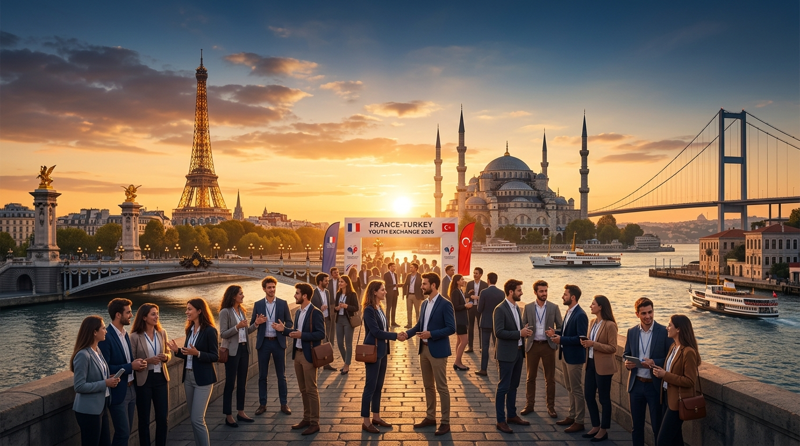
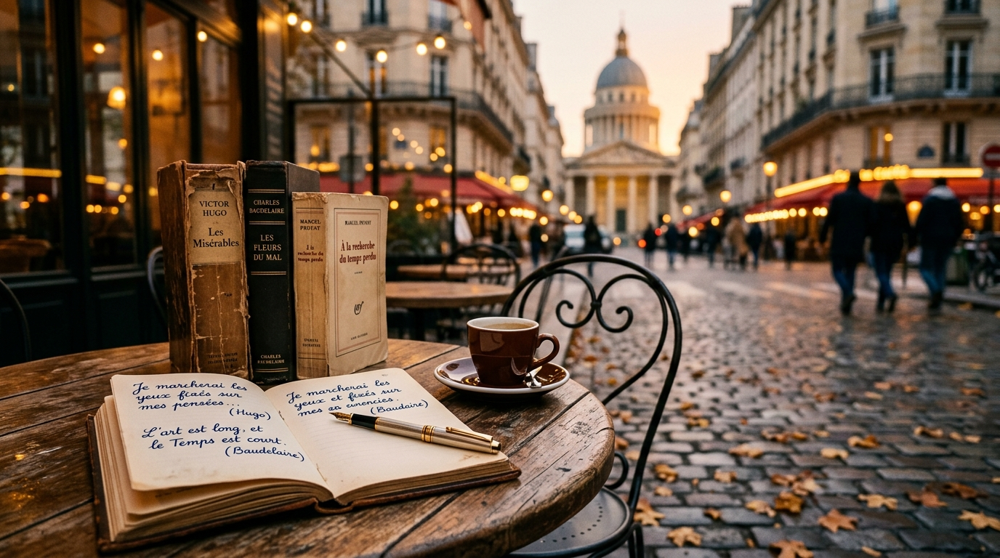
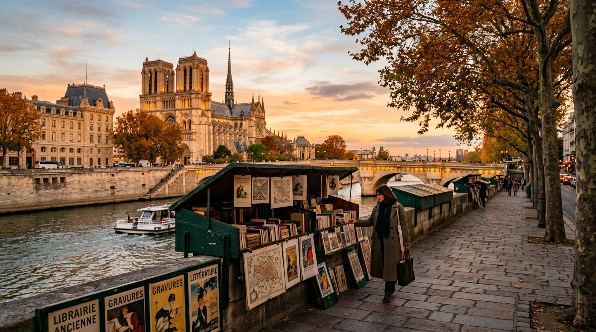
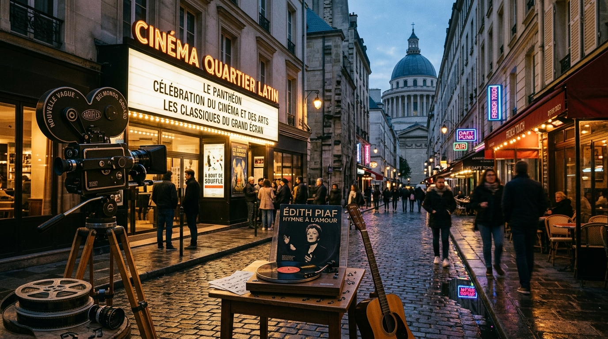
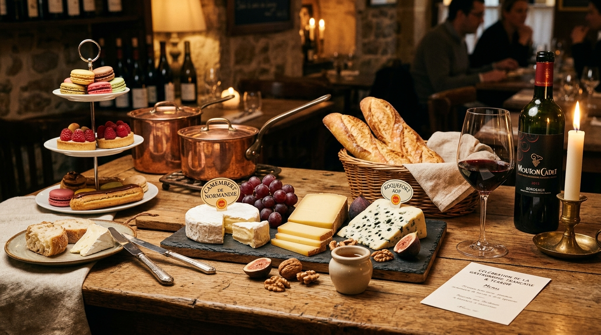
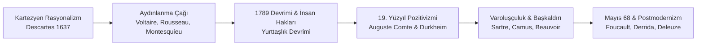
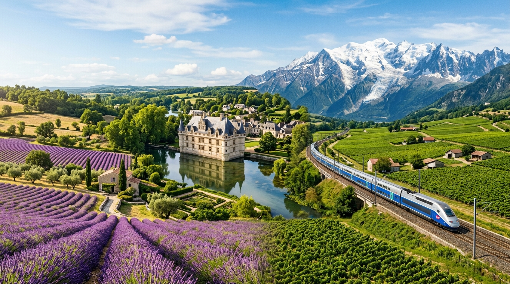
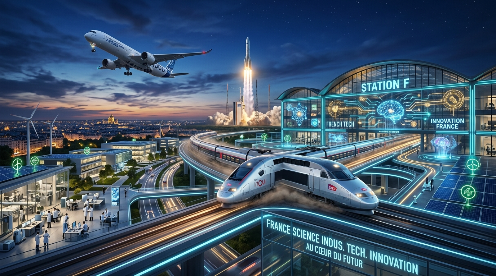
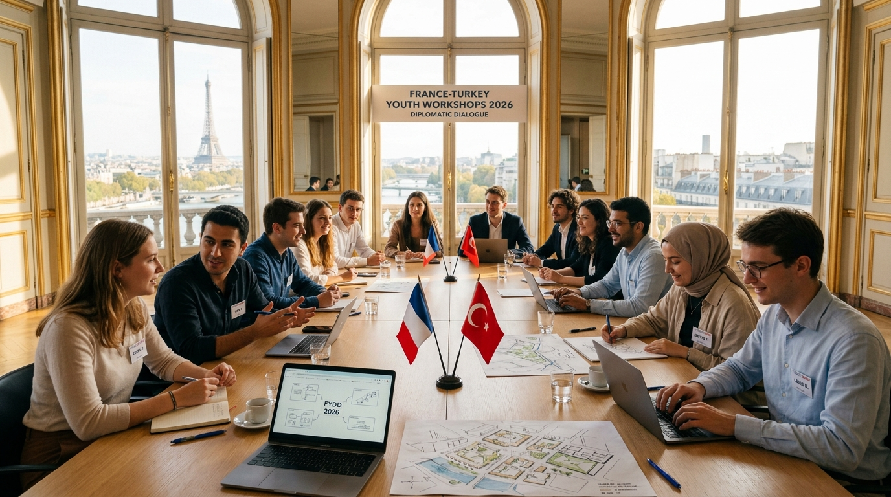

# 🇹🇷 🇫🇷 GSB Türkiye - Fransa Gençlik Değişimi 2026
### *Programme d'Échange de Jeunesse Türkiye - France 2026 & Grand Atlas Culturel de la France*

<div align="center">
  
</div>

> *"Le véritable voyage de découverte ne consiste pas à chercher de nouveaux paysages, mais à avoir de nouveaux yeux."*  
> — **Marcel Proust**, *À la recherche du temps perdu*  
> *(Asıl keşif yolculuğu yeni manzaralar aramak değil, yeni gözlere sahip olmaktır.)*

[](https://genclik.gov.tr)
[](#)
[](#)
[](LICENSE)

Bu açık kaynaklı depo; **T.C. Gençlik ve Spor Bakanlığı (GSB)** koordinasyonunda yürütülen **Türkiye - Fransa Gençlik Değişimi Programı 2026** kapsamında hazırlanmış saha seyir defterlerini, kamu diplomasisi müzakere raporlarını, kurumsal incelemeleri; ayrıca Fransa'nın felsefi, edebi, şiirsel, sanatsal, sinematografik, gastronomik, bilimsel, endüstriyel, coğrafi ve sosyolojik dokusunu ele alan ansiklopedik **Fransa Araştırma ve Kültür Atlası**nı içerir.

---

## 📑 Kapsamlı İçindekiler Tablosu

1. [🌍 Dünya Aydınlarının Gözünden Fransa ve Paris](#-dünya-aydınlarının-gözünden-fransa-ve-paris)
2. [🇹🇷 Türk Edebiyatı ve Düşüncesinde Fransa & Paris İzleri](#-türk-edebiyatı-ve-düşüncesinde-fransa--paris-izleri)
3. [📜 Fransız Düşünürlerinin Yaşam, Akıl ve İnsanlık Aforizmaları](#-fransız-düşünürlerinin-yaşam-akıl-ve-insanlık-aforizmaları)
4. [🏛️ Felsefe, Akıl ve Aydınlanma (*Les Lumières*)](#️-felsefe-akıl-ve-aydınlanma-les-lumières)
5. [⚡ Varoluşçuluk, Başkaldırı ve 20. Yüzyıl](#-varoluşçuluk-başkaldırı-ve-20-yüzyıl)
6. [📖 Fransız Edebiyatının Büyük Çağları & Şiir Antolojisi](#-fransız-edebiyatının-büyük-çağları--şiir-antolojisi)
7. [☕ Edebi Fragmanlar: Proust, Hugo ve Camus Çözümlemeleri](#-edebi-fragmanlar-proust-hugo-ve-camus-çözümlemeleri)
8. [🚶 Paris'te "Flâneur" Olmak ve Edebi Rotalar](#-pariste-flâneur-olmak-ve-edebi-rotalar)
9. [🎬 Fransız Sineması (*Le Septième Art*), Tiyatro & Müzik](#-fransız-sineması-le-septième-art-tiyatro--müzik)
10. [🍷 Fransız Gastronomisi, *Terroir* ve Peynir Haritası](#-fransız-gastronomisi-terroir-ve-peynir-haritası)
11. [⚖️ Devlet Mimarisi, Anayasal Düzen & "Laïcité"](#️-devlet-mimarisi-anayasal-düzen--laïcité)
12. [🗺️ Coğrafya ve 13 Metropoliten Bölge Atlası ("L'Hexagone")](#️-coğrafya-ve-13-metropoliten-bölge-atlası-lhexagone)
13. [🔬 Bilim, Yüksek Teknoloji, Nükleer & "La French Tech"](#-bilim-yüksek-teknoloji-nükleer--la-french-tech)
14. [🥐 Gündelik Yaşam Sosyolojisi: "L'art de vivre", Argot & Verlan](#-gündelik-yaşam-sosyolojisi-lart-de-vivre-argot--verlan)
15. [🤝 500 Yıllık Türkiye - Fransa İlişkileri & Frankofoni](#-500-yıllık-türkiye---fransa-ilişkileri--frankofoni)
16. [🗣️ Fransızca - Türkçe Diplomasi & Yaşam Sözlüğü](#️-fransızca---türkçe-diplomasi--yaşam-sözlüğü)
17. [⏳ Galya'dan 2026'ya Fransa Tarihsel Kronolojisi](#-galyadan-2026ya-fransa-tarihsel-kronolojisi)
18. [📅 2026 Değişim Programı Takvimi ve 5 Eylem Maddesi](#-2026-değişim-programı-takvimi-ve-5-eylem-maddesi)
19. [🧭 Depo Mimarisi ve Dosya Gezgini](#-depo-mimarisi-ve-dosya-gezgini)
20. [🌐 İnteraktif Portalı Çalıştırma](#-interaktif-portalı-çalıştırma)

---

## 🌍 Dünya Aydınlarının Gözünden Fransa ve Paris
### *Ce que les grands esprits du monde disent de la France et de Paris*

Fransa ve özellikle Paris; yüzyıllar boyunca dünya edebiyatçılarının, düşünürlerinin, sürgünlerinin ve sanatçılarının ilham sığınağı, estetik laboratuvarı ve ikinci vatanı olmuştur.

> *"If you are lucky enough to have lived in Paris as a young man, then wherever you go for the rest of your life, it stays with you, for Paris is a moveable feast."*  
> — **Ernest Hemingway**, *A Moveable Feast (Paris Bir Şölendir)*  
> *(Gençken Paris'te yaşama şansına eriştiyseniz, hayatınızın geri kalanında nereye giderseniz gidin o sizinle kalır; çünkü Paris taşınabilir bir şölendir.)*

> *"An artist has no home in Europe except in Paris."*  
> — **Friedrich Nietzsche**, *Ecce Homo (1888)*  
> *(Bir sanatçının Avrupa'daki tek yurdu Paris'tir.)*

> *"The best of America drifts to Paris. The American in Paris is the best American."*  
> — **F. Scott Fitzgerald** *(Muhteşem Gatsby'nin Yazarı)*  
> *(Amerika'nın en iyileri Paris'e akar; Paris'teki Amerikalı en iyi Amerikalıdır.)*

> *"I had to leave America to be able to write... Paris gave me the freedom to breathe and look at my own country with clear eyes."*  
> — **James Baldwin** *(Amerikalı Yazar & Sivil Haklar Öncüsü)*  
> *(Yazabilmek için Amerika'yı terk etmek zorundaydım... Paris bana nefes alma ve kendi ülkeme berrak gözlerle bakma özgürlüğü verdi.)*

> *"Every man has two countries, his own and France."*  
> — **Thomas Jefferson** *(ABD'nin 3. Başkanı & Bağımsızlık Bildirisi Yazarı)*  
> *(Her insanın iki ülkesi vardır: Kendi vatanı ve Fransa.)*

> *"Paris est un véritable océan. Jetez-y la sonde, vous n'en connaîtrez jamais la profondeur."*  
> — **Honoré de Balzac**, *Le Père Goriot (1835)*  
> *(Paris gerçek bir okyanustur. İskandili daldırın, derinliğini asla tam olarak bilemezsiniz.)*

> *"Respirer Paris, cela conserve l'âme."*  
> — **Victor Hugo**, *Les Misérables (1862)*  
> *(Paris'in havasını solumak, insanın ruhunu diri tutar.)*

> *"Paris is always a good idea."*  
> — **Audrey Hepburn** *(Sabrina, 1954)*  
> *(Paris her zaman iyi bir fikirdir.)*

> *"Paris, 19. yüzyılın başkentidir; cam tavanlı pasajların, devrimin barikatlarının ve kenti seyreden flâneur'ün rüya mekanıdır."*  
> — **Walter Benjamin**, *Das Passagen-Werk (Pasajlar Projesi)*

> *"When good Americans die, they go to Paris."*  
> — **Oscar Wilde**, *A Woman of No Importance (1893)*  
> *(İyi Amerikalılar öldüklerinde Paris'e giderler.)*

> *"In Paris, they simply stared when I spoke to them in French; I never did succeed in making those idiots understand their own language."*  
> — **Mark Twain** *(Mizahın Ustası)*  
> *(Paris'te onlarla Fransızca konuştuğumda öylece yüzüme baktılar; o ahmaklara kendi dillerini anlatmayı asla başaramadım!)*

> *"Paris is like an alien city, a city of light and shadows, where one can be completely alone and yet feel intensely alive."*  
> — **Henry Miller**  
> *(Paris ışık ve gölgelerin şehridir... İnsan yapayalnızken bile kendini son derece canlı hisseder.)*

> *"Paris'i düşünün; dünyanın en parlak zihinlerinin tek bir noktada toplandığı, birbirini her gün bilediği ve aydınlattığı o yeri..."*  
> — **Johann Wolfgang von Goethe**, *Eckermann ile Konuşmalar*

> *"Paris sokaklarında yürümek, tarihin bizzat kendisiyle göz göze gelmektir."*  
> — **Charles Dickens**, *A Tale of Two Cities (İki Şehrin Hikayesi)*

> *"Paris'te herkes kendini biraz şair, biraz filozof hisseder; çünkü bu şehrin taşları bile estetik fısıldar."*  
> — **Stefan Zweig**, *Dünün Dünyası (Die Welt von Gestern)*

> *"Fransa, kültürün ve roman sanatının en soylu mabedidir. Roman Avrupa'nın ruhudur ve o ruhun başkenti Paris'tir."*  
> — **Milan Kundera**, *Perde (Le Rideau)*

> *"Paris, insanı kendi iç derinliğine doğru çeken dipsiz bir aynadır."*  
> — **Rainer Maria Rilke**, *Malte Laurids Brigge'nin Notları*

> *"Paris'te soğuk bir çatı katında aç karnına otururken bile insanın içinde edebiyatın ve hikâyenin ateşi yanar."*  
> — **Gabriel García Márquez**

---

## 🇹🇷 Türk Edebiyatı ve Düşüncesinde Fransa & Paris İzleri
### *L'Empreinte de la Culture Française chez les Penseurs et Écrivains Turcs*

Tanzimat'tan Cumhuriyet'e, Türk aydınlanması ile Fransız kültürü arasında derin ve çift yönlü bir entelektüel köprü kurulmuştur.

> *"Paris'te Sorbonne sıralarında Albert Sorel'in tarih derslerini dinlerken anladım ki; milletlerin büyüklüğü geçmişlerini unutmamalarında, ama geleceğe köklerinden güç alarak yürümelerindedir. Kökü mazide olan ati biziz."*  
> — **Yahya Kemal Beyatlı** *(Paris'te 9 yıl yaşayan büyük Türk şairi)*

> *"Fransız dili, düşüncenin en keskin neşteridir. Descartes'ın aklı, Voltaire'in hicvi, Balzac'ın sosyolojik dehşeti... Fransız edebiyatını okumak, insanlığın evrensel vicdan muhasebesine katılmaktır."*  
> — **Cemil Meriç**, *Bu Ülke & Kırk Ambar*

> *"Ben sana mecburum bilemezsin / Adını mıh gibi aklımda tutuyorum / Büyüdükçe büyüyor gözlerin / Ben sana mecburum bilemezsin / İçimi seninle ısıtıyorum... Paris'te Saint-Michel rıhtımında yağmur yağarken Türk şiirinin nefesi genişliyordu."*  
> — **Attilâ İlhan**, *Sisler Bulvarı & Paris Mektupları*

> *"Baudelaire, Mallarmé ve Valéry; bize kelimelerin yalnızca birer etiket olmadığını, arkalarında gizemli bir musiki ve rüya dünyası taşıdığını öğrettiler. Şiir, dille kurulan bir büyü sanatıdır."*  
> — **Ahmet Hamdi Tanpınar**, *Edebiyat Üzerine Makaleler*

> *"Flaubert ve Balzac'ın romanlarını okurken, roman sanatının modern dünyayı anlama gücünü kavradım; İstanbul'u yazarken Flaubert'in Doğu gezisi ve Madam Bovary'nin kusursuz cümle arayışı hep zihnimdeydi."*  
> — **Orhan Pamuk** *(Nobel Edebiyat Ödüllü Yazar)*

> *"Paris'te sonbahar bir başka iner sokaklara... Baudelaire'in ve Verlaine'in mısraları rüzgarda savrulan kuru yapraklar gibi fısıldar içime."*  
> — **Cahit Sıtkı Tarancı**, *Paris Mektupları*

> *"Sorbonne'da felsefe tahsil ederken Seine Nehri kıyısında Paris'in bohem gecelerini ve insanın varoluş buhranını iliklerime kadar yaşadım. Batı'nın aklıyla Doğu'nun kalbi arasındaki büyük hesaplaşma orada başladı."*  
> — **Necip Fazıl Kısakürek**, *Bâbıâli & O ve Ben*

> *"Paris'te Louis Aragon ve Paul Éluard ile omuz omuza şiir okurken barışın, insan sevgisinin ve enternasyonal dostluğun hiçbir sınır tanımadığını gördüm."*  
> — **Nâzım Hikmet**

> *"Paris'te André Lhote atölyesinde boya sürerken, rengin ve çizginin evrensel dilini öğrendim; ama o fırçayla dönüp Anadolu'nun kilim nakışlarını ve yazmalarını yeniden keşfettim."*  
> — **Bedri Rahmi Eyüboğlu**

> *"Batı medeniyetinin kapısını aralayan anahtar, Fransız rasyonalizmi ve hürriyet mefkuresidir. Şinasi'den Namık Kemal'e, Ziya Gökalp'ten Tevfik Fikret'e kadar maarifimizin mayasında Fransız aklı vardır."*  
> — **Hilmi Ziya Ülken**, *Türkiye'de Çağdaş Düşünce Tarihi*

---

## 📜 Fransız Düşünürlerinin Yaşam, Akıl ve İnsanlık Aforizmaları

> *"Tout le malheur des hommes vient d'une seule chose, qui est de ne pas savoir demeurer en repos, dans une chambre."*  
> — **Blaise Pascal**, *Pensées (1670)*  
> *(Bütün insanların mutsuzluğu tek bir şeyden kaynaklanır: Kendi odasında sessizce tek başına durmayı bilememekten.)*

> *"Sur le plus beau trône du monde, on n'est jamais assis que sur son cul."*  
> — **Michel de Montaigne**, *Les Essais (1580)*  
> *(Dünyanın en güzel tahtına da çıksanız, oturacağınız yer yine kendi kıçınızın üstüdür.)*

> *"La vraie vie est absente. Nous ne sommes pas au monde."*  
> — **Arthur Rimbaud**, *Une Saison en enfer (1873)*  
> *(Gerçek hayat burada değil. Biz dünyada değiliz.)*

> *"Changer la vie !"*  
> — **Arthur Rimbaud**  
> *(Hayatı değiştirmeli!)*

> *"La beauté n'est que la promesse du bonheur."*  
> — **Stendhal** *(Henri Beyle), De l'amour (1822)*  
> *(Güzellik, mutluluğun vaadinden başka bir şey değildir.)*

> *"Le désespoir est l'asile des lâches."*  
> — **Honoré de Balzac**  
> *(Umutsuzluk, korkakların sığınağıdır.)*

> *"La vérité est en marche et rien ne l'arrêtera."*  
> — **Émile Zola**, *Dreyfus Davası Bildirisi (1898)*  
> *(Hakikat yürüyüşe geçti ve onu hiçbir güç durduramaz.)*

> *"Le vent se lève !.. Il faut tenter de vivre !"*  
> — **Paul Valéry**, *Le Cimetière marin (1920)*  
> *(Rüzgâr yükseliyor!.. Yaşamayı denemek gerek!)*

> *"On ne découvre pas de terre nouvelle sans consentir à perdre de vue, très longtemps, tout rivage."*  
> — **André Gide**, *Les Faux-monnayeurs (1925)*  
> *(Kıyıyı çok uzun süre gözden kaybetmeyi göze almadıkça yeni topraklar keşfedemezsiniz.)*

> *"L'attention est la forme la plus rare et la plus pure de la générosité."*  
> — **Simone Weil**, *Attente de Dieu (1950)*  
> *(Dikkat ve özen, cömertliğin en nadir ve en saf biçimidir.)*

> *"Penser, c'est créer des concepts."*  
> — **Gilles Deleuze & Félix Guattari**, *Qu'est-ce que la philosophie ? (1991)*  
> *(Düşünmek, yeni kavramlar yaratmaktır.)*

> *"La plus perdue de toutes les journées est celle où l'on n'a pas ri."*  
> — **Nicolas Chamfort**, *Maximes et Pensées (1795)*  
> *(Günlerin en çok boşa harcanmış olanı, insanın bir kez bile gülmediği gündür.)*

> *"L'amour-propre est le plus grand de tous les flatteurs."*  
> — **François de La Rochefoucauld**, *Maximes (1665)*  
> *(Öz sevgi ve benlik, dalkavukların en büyüğüdür.)*

---

## 🏛️ Felsefe, Akıl ve Aydınlanma (*Les Lumières*)

> *"Cogito, ergo sum." (Je pense, donc je suis.)*  
> — **René Descartes**, *Discours de la méthode (1637)*  
> *(Düşünüyorum, öyleyse varım.)*

> *"Je ne suis pas d'accord avec ce que vous dites, mais je me battrai jusqu'à la mort pour que vous ayez le droit de le dire."*  
> — **Voltaire** *(François-Marie Arouet)*  
> *(Söylediklerinizle hemfikir değilim; ancak bunu söyleme hakkınızı sonuna kadar savunacağım.)*

> *"L'homme est né libre, et partout il est dans les fers."*  
> — **Jean-Jacques Rousseau**, *Du contrat social (1762)*  
> *(İnsan özgür doğar, oysa her yerde zincire vurulmuştur.)*

> *"Pour qu'on ne puisse abuser du pouvoir, il faut que, par la disposition des choses, le pouvoir arrête le pouvoir."*  
> — **Montesquieu**, *De l'esprit des lois (1748)*  
> *(İktidarın kötüye kullanılmasını önlemek için, işlerin öyle bir düzenlenmesi gerekir ki iktidar iktidarı durdurabilsin.)*

> *"Le cœur a ses raisons que la raison ne connaît point."*  
> — **Blaise Pascal**, *Pensées (1670)*  
> *(Gönlün, aklın hiç bilmediği öyle gerekçeleri vardır ki.)*

> *"Que sais-je ?"*  
> — **Michel de Montaigne**, *Les Essais (1580)*  
> *(Ben ne biliyorum ki? / Kuşkucu bilgeliğin kurucu sorusu)*

---

## ⚡ Varoluşçuluk, Başkaldırı ve 20. Yüzyıl

> *"L'existence précède l'essence."*  
> — **Jean-Paul Sartre**, *L'existentialisme est un humanisme (1946)*  
> *(Varoluş özden önce gelir.)*

> *"L'homme est condamné à être libre ; parce qu'une fois jeté dans le monde, il est responsable de tout ce qu'il fait."*  
> — **Jean-Paul Sartre**  
> *(İnsan özgür olmaya mahkûmdur; çünkü bir kez dünyaya atıldıktan sonra yaptığı her şeyden sorumludur.)*

> *"On ne naît pas femme : on le devient."*  
> — **Simone de Beauvoir**, *Le Deuxième Sexe (1949)*  
> *(Kadın doğulmaz, kadın olunur.)*

> *"Au milieu de l'hiver, j'ai découvert en moi un invincible été."*  
> — **Albert Camus**, *Retour à Tipasa (1952)*  
> *(Kışın tam ortasında, içimde yenilmez bir yaz olduğunu keşfettim.)*

> *"Je me révolte, donc nous sommes."*  
> — **Albert Camus**, *L'Homme révolté (1951)*  
> *(Başkaldırıyorum, öyleyse varız.)*

> *"Là où il y a pouvoir, il y a résistance."*  
> — **Michel Foucault**, *Histoire de la sexualité (1976)*  
> *(Nerede iktidar varsa, orada direniş vardır.)*

---

## 📖 Fransız Edebiyatının Büyük Çağları & Şiir Antolojisi

<div align="center">
  
</div>

Fransız edebiyatı, Orta Çağ şövalye destanlarından (*Chanson de Roland*) 21. yüzyıl çağdaş romanına kadar insanın evrensel dramını dile getirmiştir.

```text
[ 17. YY KLASİSİZM ] ➔ [ 18. YY AYDINLANMA ] ➔ [ 19. YY ROMANTİZM / REALİZM ] ➔ [ 19. YY SEMBOLİZM ] ➔ [ 20. YY VAROLUŞÇULUK ]
  (Molière, Racine)      (Voltaire, Rousseau)     (Hugo, Balzac, Flaubert, Zola)     (Baudelaire, Rimbaud)     (Sartre, Camus, Proust)
```

### 1. Şiir Seçkisi I: Charles Baudelaire — *L'Albatros* (Kötülük Çiçekleri, 1857)

```text
Souvent, pour s'amuser, les hommes d'équipage
Gagnent de grands oiseaux des mers, les albatros,
Qui suivent, indolents compagnons de voyage,
Le navire glissant sur les gouffres amers.

Le Poète est semblable au prince des nuées
Qui hante la tempête et se rit de l'archer ;
Exilé sur le sol au milieu des huées,
Ses ailes de géant l'empêchent de marcher.
```
> *(Eğlenmek için sık sık gemi tayfaları yakalar o koca deniz kuşlarını, albatrosları... Şair de tıpkı bu bulutlar prensine benzer: fırtınalarda uçan, okçularla alay eden; yuhalamalar ortasında yeryüzüne sürgün edilince, o devasa kanatları yürümesine engel olur.)*

---

### 2. Şiir Seçkisi II: Paul Verlaine — *Chanson d'automne* (Sonbahar Şarkısı, 1866)

```text
Les sanglots longs
Des violons
De l'automne
Blessent mon cœur
D'une langueur
Monotone.

Et je m'en vais
Au vent mauvais
Qui m'emporte
Deçà, delà,
Pareil à la
Feuille morte.
```
> *(Sonbahar kemanlarının uzun hıçkırıkları yaralar yüreğimi tekdüze bir uyuşuklukla... Ve çeker giderim beni oradan oraya savuran o uğursuz rüzgârda, tıpkı kuru bir yaprak gibi.)*

---

### 3. Şiir Seçkisi III: Paul Éluard — *Liberté* (Özgürlük, 1942 - Direniş Şiiri)

```text
Sur mes cahiers d'écolier
Sur mon pupitre et les arbres
Sur le sable sur la neige
J'écris ton nom

Et par le pouvoir d'un mot
Je recommence ma vie
Je suis né pour te connaître
Pour te nommer
Liberté.
```
> *(Okul defterlerimin üstüne / Sırama ve ağaçlara / Kuma ve kara / Yazarım adını... Ve bir tek sözcüğün gücüyle / Yeniden başlarım hayatıma / Seni tanımak için doğmuşum / Sana adını vermek için: ÖZGÜRLÜK.)*

---

## ☕ Edebi Fragmanlar: Proust, Hugo ve Camus Çözümlemeleri

### 1. Marcel Proust: Çay, Madlen Keki ve İstemsiz Bellek (*Mémoire Involontaire*)
> *"Et tout d'un coup le souvenir m'est apparu. Ce goût, c'était celui du petit morceau de madeleine que le dimanche matin à Combray... ma tante Léonie m'offrait après l'avoir trempé dans son infusion de thé ou de tilleul..."*  
> — **Marcel Proust**, *Du côté de chez Swann (1913)*  
> *(Ve birdenbire hatıra beliriverdi karşımda. Bu tat, Combray'de pazar sabahları Léonie halamın ıhlamuruna ya da çayına batırıp bana ikram ettiği o küçük madlen keki parçasının tadıydı... Geçmiş, aklımızın çabasıyla değil, bir kokunun veya tadın duyusal uyarısıyla bütün tazeliğiyle dirilirdi.)*

### 2. Victor Hugo: Piskopos Myriel ve Gümüş Şamdanlar Sahnesi
> *Jean Valjean piskoposun evinden gümüş takımları çalıp jandarma tarafından yakalandığında, Piskopos Myriel jandarmalara şöyle der:*  
> *"Onları ben hediye ettim. Hatta şamdanları da vermiştim, neden onları da almadınız kardeşim?" Ve Valjean'a fısıldar: "Jean Valjean, kardeşim, artık kötülüğe değil, iyiliğe aitsiniz. Ruhunuzu karanlıktan satın alıp Tanrı'ya teslim ediyorum."*  
> — **Victor Hugo**, *Les Misérables (1862)*

### 3. Albert Camus: *L'Étranger* ve *La Peste* Başlangıçları
> *"Aujourd'hui, maman est morte. Ou peut-être hier, je ne sais pas."*  
> — **Albert Camus**, *L'Étranger (Yabancı - 1942)*  
> *(Bugün annem öldü. Belki de dün, bilmiyorum. / Modern yabancılaşmanın en çarpıcı açılışı)*

---

## 🚶 Paris'te "Flâneur" Olmak ve Edebi Rotalar

<div align="center">
  
</div>

*Flânerie*; hiçbir yere yetişme kaygısı gütmeden, kenti açık hava müzesi gibi seyretme ve kalabalıklar içinde tek başına kentin ruhunu dinleme felsefesidir (Baudelaire & Walter Benjamin).

### Paris'in 5 Büyük Edebi Yürüyüş Rotası:
1. **Saint-Germain-des-Prés:** *Café de Flore* & *Les Deux Magots* (Sartre, Simone de Beauvoir ve Camus'nün buluşma noktası).
2. **Quartier Latin & Panthéon:** 13. yüzyıldan beri bilimin kalbi Sorbonne, Shakespeare & Company kitapçısı ve Fransa'nın büyük evlatlarının yattığı Panthéon.
3. **Montmartre Tepesi:** Picasso'nun *Avignonlu Kızlar* tablosunu yaptığı *Le Bateau-Lavoir*, Sacré-Cœur ve bohem sanatçı sokakları.
4. **Seine Rıhtımları & Bouquinistes:** 16. yüzyıldan bu yana nehir boyunca sıralanan yeşil ahşap kutulu sahaf geleneği (UNESCO Mirası).
5. **Le Marais & Place des Vosges:** Victor Hugo'nun *Sefiller* romanını yazdığı tarihi evi (*Maison de Victor Hugo*).

---

## 🎬 Fransız Sineması (*Le Septième Art*), Tiyatro & Müzik

<div align="center">
  
</div>

### 1. Yedinci Sanat: Lumière Kardeşlerden Nouvelle Vague'a
* **Sinemanın Doğuşu (1895):** Auguste ve Louis Lumière kardeşlerin Lyon'dan Paris'e getirdiği ilk hareketli görüntüler.
* **Yeni Dalga (*La Nouvelle Vague* - 1958):** Jean-Luc Godard (*À bout de souffle*), François Truffaut (*400 Darbe*), Agnès Varda. Stüdyo dekorları yerine Paris sokaklarında doğal ışıkla çekilen, atlamalı kurgulu (*jump cut*) auteur sineması.

### 2. Tiyatro: Comédie-Française'den Absürd Tiyatroya
* **Molière & Racine:** 1680'de kurulan dünyanın en eski devlet tiyatrosu *Comédie-Française*.
* **Uyumsuz / Saçma Tiyatrosu (*Théâtre de l'Absurde*):** Samuel Beckett (*Godot'yu Beklerken*) ve Eugène Ionesco (*Kel Şarkıcı, Gergedanlar*).

### 3. Müzik: La Chanson Française & French Touch
* **Chanson Ekolü:** Édith Piaf (*La Vie en rose*), Jacques Brel (*Ne me quitte pas*), Charles Aznavour (*La Bohème*), Serge Gainsbourg.
* **Elektronik Devrim (*French Touch*):** Daft Punk (*Discovery, Random Access Memories*), Justice, Air, Phoenix.

---

## 🍷 Fransız Gastronomisi, *Terroir* ve Peynir Haritası

<div align="center">
  
</div>

Fransız Gastronomi Yemeği, 2010 yılından bu yana **UNESCO Somut Olmayan Kültürel Mirası** listesindedir.

### 1. *Terroir* Felsefesi ve AOP Kalite Sistemi
*Terroir*; toprağın mineralleri, güneş açısı, mikro-klima ve nesiller boyu aktarılan insan ustalığının (*savoir-faire*) ürüne kattığı taklit edilemez kimliktir.

### 2. 1200+ Çeşit ve Büyük Peynir Aileleri:
* **Comté AOP (Bourgogne-Franche-Comté):** 6 ila 36 ay mağarada olgunlaştırılan sert, meyvemsi inek peyniri.
* **Roquefort AOP (Occitanie):** Combalou doğal kireçtaşı mağaralarında olgunlaşan çiğ koyun sütü mavi damarlı peynir.
* **Camembert de Normandie AOP (Normandie):** Kremsi dokulu, beyaz kadife kabuklu tarihi peynir.
* **Reblochon AOP (Alpler):** Yıkanmış kabuklu, fındıksı Alp peyniri (*Tartiflette* yemeğinin temeli).
* **Sainte-Maure de Touraine AOP (Loire Vadisi):** Ortasında meşe samanı çubuğu bulunan kül kaplı keçi peyniri (*Chèvre*).

### 3. Fırıncılık & Pastacılık (*Boulangerie & Pâtisserie*):
* **Geleneksel Baget (*Baguette de tradition*):** 2022 UNESCO Mirası. Yalnızca 4 malzeme (un, su, maya, tuz) ve katkısız uzun fermantasyon.
* **Kruvasan & Viennoiserie:** Kaliteli Fransız tereyağıyla kat kat lamine edilen çıtır hamurlar.
* **Klasikler:** Éclair, Paris-Brest, Mille-feuille, Tarte Tatin, Canelé de Bordeaux, Macaron.

---

## 🏛️ Fransa'nın Felsefi Temelleri & Fikir Tarihi



* **René Descartes (1596–1650):** Kartezyen şüphe ve akılcılık (*Discours de la méthode*).
* **Voltaire (1694–1778):** Dini hoşgörü ve düşünce özgürlüğü savunusu (*Traité sur la tolérance*).
* **Jean-Jacques Rousseau (1712–1778):** Halk egemenliği ve toplum sözleşmesi (*Du contrat social*).
* **Montesquieu (1689–1755):** Kuvvetler ayrılığı ilkesi (*De l'esprit des lois*).
* **1789 İnsan ve Yurttaş Hakları Bildirisi:** Evrensel eşitlik, masumiyet karinesi ve mülkiyet dokunulmazlığı.
* **Jean-Paul Sartre & Simone de Beauvoir & Albert Camus:** Varoluşçuluk, etik sorumluluk ve başkaldırı felsefesi.

---

## ⚖️ Devlet Mimarisi, Anayasal Düzen & "Laïcité"

### 1. Beşinci Cumhuriyet (*La Ve République* - 1958)
* **Cumhurbaşkanı (*Président* - Élysée):** 5 yıllık süreyle doğrudan halk tarafından seçilir. Dış politika, nükleer caydırıcılık ve silahlı kuvvetlerin başıdır; meclisi feshedebilir.
* **Başbakan ve Hükûmet (*Matignon*):** Kanun tasarılarını hazırlar, idareyi yürütür; meclis çoğunluğuna dayanır.
* **Çift Meclis:** 577 üyeli Ulusal Meclis (*Assemblée Nationale*) ve 348 üyeli Senato (*Sénat*).
* **Conseil Constitutionnel (Anayasa Konseyi) & Conseil d'État (Danıştay):** Norm denetimi ve yüksek idari yargı.

### 2. Laiklik İlkesi (*Laïcité* - 9 Aralık 1905 Yasası)
* **Devletin Mutlak Tarafsızlığı (*Neutralité de l'État*):** Devlet hiçbir inancı tanımaz, maaşa bağlamaz, finanse etmez.
* **Vicdan Özgürlüğü:** İnanma ve inanmama hakkı eşit korunur.
* **Kamusal Alanda Nötrlük:** Kamu görevlileri tarafsızdır; okullar cumhuriyetçi tarafsız aklın geliştiği alanlardır.

---

## 🗺️ Coğrafya ve 13 Metropoliten Bölge Atlası ("L'Hexagone")

<div align="center">
  
</div>

Fransa anakarası, 6 köşeli geometrisi sebebiyle **"L'Hexagone" (Altıgen)** olarak anılır. 643.801 km² yüzölçümüyle AB'nin en geniş toprağına sahiptir.

```text
                                [ HAUTS-DE-FRANCE ]
                                   (Lille, Amiens)
               [ NORMANDIE ]                              [ GRAND EST ]
              (Rouen, Le Havre)    [ ÎLE-DE-FRANCE ]    (Strasbourg, Reims)
   [ BRETAGNE ]                        (Paris)
 (Rennes, Brest)       [ CENTRE-VAL DE LOIRE ]    [ BOURGOGNE-FRANCHE-COMTÉ ]
                           (Orléans, Tours)             (Dijon, Besançon)
  [ PAYS DE LA LOIRE ]
    (Nantes, Angers)                                [ AUVERGNE-RHÔNE-ALPES ]
                                                          (Lyon, Grenoble)
            [ NOUVELLE-AQUITAINE ]
              (Bordeaux, Limoges)       [ OCCITANIE ]            [ PACA ]
                                    (Toulouse, Montpellier)  (Marseille, Nice)
                                                                [ CORSE ]
                                                                (Ajaccio)
```

| Bölge (*Région*) | Nüfus | Merkez Şehirler | Temel Kimlik & Sektörler |
| :--- | :--- | :--- | :--- |
| **Île-de-France** | 12.4M | Paris, Versailles | Diplomasi, Sorbonne, Louvre, Station F, La Défense. GSYİH'nin %31'i. |
| **Auvergne-Rhône-Alpes** | 8.1M | Lyon, Grenoble, Annecy | Gastronomi başkenti Lyon, Mont Blanc (4808 m), nanoteknoloji, nükleer. |
| **PACA** | 5.1M | Marseille, Nice, Cannes | Akdeniz limanı Marseille, Fransız Rivierası, Greko-Romen kalıntıları. |
| **Occitanie** | 6.0M | Toulouse, Montpellier | Avrupa havacılık üssü Airbus, CNES uzay ajansı, Carcassonne kalesi. |
| **Nouvelle-Aquitaine** | 6.0M | Bordeaux, Limoges | Dünya şarap başkenti Bordeaux, Atlantik kıyıları, Dassault havacılık. |
| **Grand Est** | 5.5M | Strasbourg, Reims, Metz | Avrupa Parlamentosu & AİHM kenti Strasbourg, Şampanya bağları. |
| **Hauts-de-France** | 6.0M | Lille, Amiens, Calais | Manş Tüneli (İngiltere kapısı), Batarya Vadisi (*Battery Valley*). |
| **Normandie** | 3.3M | Rouen, Caen, Le Havre | 1944 D-Day Çıkarma Sahilleri, Empresyonizm, Mont-Saint-Michel. |
| **Bretagne** | 3.4M | Rennes, Brest | Kelt mirası, Breton dili, Atlantik Donanma Üssü, siber güvenlik. |
| **Bourgogne-Franche-Comté** | 2.8M | Dijon, Besançon, Belfort | Burgonya şarapları, Besançon ince saat mekaniği, Alstom TGV fabrikaları. |
| **Centre-Val de Loire** | 2.6M | Orléans, Tours | UNESCO Loire Şatoları (Chambord, Chenonceau), Kozmetik Vadisi. |
| **Pays de la Loire** | 3.8M | Nantes, Saint-Nazaire | Dünyanın en büyük yolcu gemisi tersaneleri, Jules Verne şehri Nantes. |
| **Corse (Korsika)** | 350K | Ajaccio, Bastia | Dağlık Akdeniz adası, Napoléon'un doğum yeri, Korsika dili. |

---

## 🔬 Bilim, Yüksek Teknoloji, Nükleer & "La French Tech"

<div align="center">
  
</div>

* **Nükleer Enerji Modeli (*Messmer Planı*):** 56 ticari reaktör ile elektriğin ~%70'ini nükleerden karşılar (~50g CO2/kWh emisyon). ITER nükleer füzyon araştırma reaktörüne ev sahipliği yapar (Cadarache).
* **Havacılık & Uzay:** Toulouse merkezli **Airbus**, Fransız Guyanası Kourou Uzay Limanı'ndan fırlatılan **Ariane 6** roketleri, Dassault Aviation (*Rafale* savaş uçakları), Safran motorları.
* **Raylı Sistemler (TGV - Alstom):** 1981'den bu yana raylı sistemlerde dünya lideri. Modifiye TGV V150 treni **574,8 km/s** hızla dünya ray hız rekorunu elinde tutmaktadır.
* **Girişimcilik ve Yapay Zekâ (*La French Tech*):** Paris merkezli dünyanın en büyük startup kampüsü **Station F** (34.000 m²). Avrupa'nın açık kaynak yapay zekâ öncüsü **Mistral AI**, Doctolib, BlaBlaCar, INRIA ve CNRS.

---

## 🥐 Gündelik Yaşam Sosyolojisi: "L'art de vivre", Argot & Verlan

### 1. Yaşama Sanatı (*L'art de vivre*)
* **Öğle ve Akşam Sofrası:** Yemeği aceleye getirmeyen, dostlarla sohbeti merkeze alan ritüel.
* **Kafe Terası:** Kaldırıma bakan masalarda kitap okuma, insanları izleme (*observer les passants*) ve gazete tarama kültürü.

### 2. Yaşayan Sokak Dili: Verlan ve Argot
Fransız gençliğinin ve sokak kültürünün dinamik dil yapısı:
* **Verlan (*L'envers* - Heceleri Ters Çevirme):**
  * *Femme* ➔ **Meuf** (Kadın / Kız arkadaş)
  * *Fou* ➔ **Ouf** (Çılgın / C'est un truc de ouf!)
  * *Bizarre* ➔ **Zarbi** (Tuhaf)
  * *Merci* ➔ **Cimer** (Sağ ol)
  * *Laisse tomber* ➔ **Laisse béton** (Boşver)
* **Argot Terimleri:**
  * *Le boulot / Le taf:* İş, çalışma
  * *Bouffer:* Yemek yemek
  * *Un pote:* Kanka, yakın dost
  * *Kiffer:* Çok sevmek (*Je kiffe trop*)
  * *Avoir le seum:* Sinir olmak, bozulmak

---

## 🤝 500 Yıllık Türkiye - Fransa İlişkileri & Frankofoni

* **1536 İttifakı:** Kanuni Sultan Süleyman ile Fransa Kralı I. François arasındaki tarihi diplomatik ve askeri ittifak; İstanbul'da açılan ilk daimi Fransız elçiliği (Jean de La Forêt).
* **Aydınlanma ve Tanzimat:** Şinasi, Namık Kemal ve Jön Türklerin Paris'teki entelektüel temasları; Fransız idare hukuku ve belediyeciliğinin Türkiye'ye aktarımı.
* **Eğitim Köprüsü:** 1868'de kurulan **Galatasaray Lisesi** (*Mekteb-i Sultani*) ve 1992 Türkiye-Fransa Hükümetlerarası Anlaşması ile kurulan **Galatasaray Üniversitesi**.
* **Türkçede Yaşayan 5000+ Fransızca Kökenli Kelime:** Televizyon, Gar, Abajur, Kuaför, Şoför, Pantolon, Viraj, Randevu, Asansör, Bisküvi, Şofben, Plaj, Koridor, Balkon, Kolye vb.

---

## 🗣️ Fransızca - Türkçe Diplomasi & Yaşam Sözlüğü

| Fransızca Terim / İfade | Telaffuz | Türkçe Karşılığı | Alan |
| :--- | :--- | :--- | :--- |
| **La diplomatie publique** | *la di-plo-ma-si pü-blik* | Kamu diplomasisi | Diplomasi |
| **L'engagement citoyen (m)** | *lan-gaj-man si-twa-yan* | Yurttaşlık katılımı / Gönüllülük | Diplomasi |
| **Le développement durable** | *lö dev-lop-man dü-rabl* | Sürdürülebilir kalkınma | Çevre / Politika |
| **La table ronde** | *la tabl rond* | Yuvarlak masa toplantısı | Diplomasi |
| **Le compte-rendu** | *lö kont-ran-dü* | Toplantı tutanağı / Rapor | Diplomasi |
| **Bonjour / Bonsoir** | *bon-jur / bon-swar* | İyi günler / İyi akşamlar | Günlük Yaşam |
| **S'il vous plaît** | *sil vu ple* | Lütfen (Resmi) | Günlük Yaşam |
| **Je vous en prie** | *jö vu zan pri* | Rica ederim | Günlük Yaşam |
| **L'addition, s'il vous plaît** | *la-di-syon sil vu ple* | Hesap lütfen | Seyahat / Kafe |
| **Où se trouve la gare ?** | *u sö truv la gar* | Gar nerede bulunuyor? | Seyahat |
| **C'est un truc de ouf !** | *se tün trük dö uf* | Çılgınca / İnanılmaz bir şey! | Argot / Verlan |
| **Un pote / Une pote** | *ön pot* | Kanka / Yakın arkadaş | Argot |
| **Poser un lapin** | *po-ze ön la-pen* | Randevuya gelmemek, ekmek | Deyim |
| **Avoir le coup de foudre** | *a-vwar lö ku dö fudr* | İlk görüşte aşık olmak / vurulmak | Deyim |

---

## ⏳ Galya'dan 2026'ya Fransa Tarihsel Kronolojisi

```text
M.Ö. 52   ──> Alesia Kuşatması: Jül Sezar & Vercingétorix (Galya'nın Roma'ya Katılışı)
486       ──> Frank Krallığı: I. Clovis'in Hristiyanlığı Kabulü ve Merovenj Hanedanı
800       ──> Şarlman'ın (Charlemagne) Kutsal Roma İmparatoru Olarak Taç Giymesi
1536      ──> Kanuni Sultan Süleyman & I. François Osmanlı-Fransız İttifakı
1661-1715 ──> XIV. Louis (Güneş Kral) & Versailles Sarayı'nda Mutlak Monarşinin Zirvesi
1789      ──> 14 Temmuz Bastille Baskını & İnsan ve Yurttaş Hakları Bildirisi
1804      ──> I. Napoléon Bonaparte'ın İmparatorluk İlanı ve Medeni Kanun (Code Civil)
1871      ──> Paris Komünü (Dünyanın ilk işçi özyönetimi) & III. Cumhuriyetin Kuruluşu
1905      ──> 9 Aralık Laïcité Kanunu (Kilise ile Devlet İşlerinin Kesin Ayrılması)
1944      ──> Normandiya Çıkarması (D-Day), Paris'in Kurtuluşu ve Kadınlara Oy Hakkı
1958      ──> General Charles de Gaulle Önderliğinde V. Cumhuriyet Anayasası
1968      ──> Mayıs 68 Olayları: Üniversite Boykotları ve 10 Milyonluk Genel Grev
1981      ──> İlk TGV Yüksek Hızlı Tren Hattının Açılışı (Paris - Lyon)
2026      ──> GSB Türkiye - Fransa Gençlik Değişimi Programı & İkili Eylem Planı
```

---

## 📅 2026 Değişim Programı Takvimi ve 5 Eylem Maddesi

<div align="center">
  
</div>

| Aşama | Tarih / Konum | Odak Alanı & Temel Faaliyetler | Durum |
| :--- | :--- | :--- | :---: |
| **I. Hazırlık** | Ankara / Çevrim içi | Heyet seçimi, diplomatik brifingler, dil ve kültür atölyeleri | 🟢 Tamamlandı |
| **II. Türkiye Etabı** | Ankara & İstanbul | Anıtkabir, GSB Bakanlığı, Altındağ GM, Galatasaray Lisesi, Ortak Çalıştaylar | 🟢 Tamamlandı |
| **III. Fransa Etabı** | Paris & Lyon | Fransız Bakanlığı, MJC Ağı, Station F, UNESCO, Vieux Lyon İpekçilik İncelemesi | 🟢 Tamamlandı |
| **IV. Çıktı & Yayın** | Açık Kaynak / Web | Kapsamlı Kültür Atlası, Ortak Bildiri, İki Dilli Web Portalı ve Eylem Planı | 🟢 Yayında |

### 🎯 2026–2027 Ortak Eylem Maddeleri:
1. **ACT-01:** Türkiye-Fransa Yıllık Gençlik Forumu (Ankara & Paris).
2. **ACT-02:** 10 Kardeş Gençlik Merkezi Eşleştirmesi (GSB Gençlik Merkezleri & MJC Ağı).
3. **ACT-03:** Yeşil Şehircilik ve İklim Hackathonu (Station F & Teknoparklar).
4. **ACT-04:** İki Dilli Dijital Gençlik Medya Platformu ve Podcast Serisi.
5. **ACT-05:** Karşılıklı Gönüllülük Değişimi (*Service Civique* & GSB Gönüllülük Ağı).

---

## 🧭 Depo Mimarisi ve Dosya Gezgini

```text
gsb-france-exchange-2026/
├── assets/                                # 🖼️ Görsel Varlıklar ve 8 Tematik Banner
│   └── images/
│       ├── banner-hero-diplomacy.jpg      # 🇹🇷 🇫🇷 Gençlik Diplomasisi & İstanbul-Paris Köprüsü
│       ├── banner-literature-philosophy.jpg# 📚 Edebiyat, Felsefe ve Saint-Germain Masası
│       ├── banner-paris-flaneur.jpg       # 🚶 Paris Flânerie, Seine Rıhtımları & Bouquinistes
│       ├── banner-cinema-arts.jpg         # 🎬 Nouvelle Vague Sineması, Tiyatro & Chanson
│       ├── banner-regions-geography.jpg   # 🗺️ Fransa Coğrafyası (Lavanta, Şato, Alpler, TGV)
│       ├── banner-gastronomy-terroir.jpg  # 🍷 Gastronomi, AOP Peynirleri, Şarap & Baget
│       ├── banner-science-tech.jpg        # 🔬 Airbus, Ariane 6, TGV ve Station F
│       └── banner-workshops-diplomacy.jpg # 🤝 Gençlik Çalıştayları ve İkili Müzakere Masası
│
├── README.md                              # 📘 Kapsamlı Başvuru Kılavuzu & Kültür Atlası
├── index.html                             # 🌐 İnteraktif Web Portalı ve Dijital Atlas
├── style.css                              # 🎨 Modern Portal Arayüz Stilleri (Glassmorphism & Dual Theme)
├── app.js                                 # ⚡ Dinamik Arama, Sesli Şiir Okuyucu, Flashcard & 20 Soruluk Quiz Motoru
│
├── france-atlas/                          # 📚 Kapsamlı Fransa Araştırma Atlası
│   ├── franco-turkish-relations.md        # 🇹🇷🤝🇫🇷 500 Yıllık Türkiye-Fransa Diplomasi ve Kültür Köprüsü (1536-2026)
│   ├── music-sound-traditions.md          # 🎵 Barok Opera, Debussy Empresyonizmi, Chanson & French Touch
│   ├── french-poetry-anthology.md         # 📜 Baudelaire, Rimbaud, Verlaine, Éluard, Prévert
│   ├── gastronomy-terroir-guide.md        # 🍷 Terroir, Peynirler, Şaraplar, Baget & Michelin
│   ├── cinema-theatre-music.md            # 🎬 Nouvelle Vague, Absürd Tiyatro, Chanson & Daft Punk
│   ├── paris-flaneur-guide.md             # 🚶 Flânerie Felsefesi, Edebi Rotalar ve Bouquinistes
│   ├── history-thought.md                 # 🏛️ Aydınlanma, Devrimler, Varoluşçuluk ve Mayıs 68
│   ├── institutions-state.md              # ⚖️ 5. Cumhuriyet, Yarı-Başkanlık, Laïcité ve MJC Modeli
│   ├── geography-regions.md               # 🗺️ "L'Hexagone", 13 Metropoliten Bölge ve Şehir Atlası
│   ├── arts-literature.md                 # 🎨 Edebiyat, Flânerie, Empresyonizm ve Gotik Mimari
│   ├── science-industry.md                # 🔬 Nükleer Enerji, Airbus/Uzay, TGV ve French Tech
│   ├── everyday-culture.md                # 🥐 Art de Vivre, Gastronomi, Argot ve Verlan
│   └── vocabulary-guide.md                # 🗣️ Diplomasi, Müzakere ve Günlük Fransızca Kılavuzu
│
├── workshops/                             # 🏛️ Tematik Gençlik Çalıştayları ve Müzakereler
│   ├── youth-diplomacy.md                 # 🌐 Kamu Diplomasisi ve Türkiye-Fransa İkili İlişkileri
│   ├── intercultural-dialogue.md          # 🌍 Kültürlerarası İletişim ve Tarihsel Köprüler
│   ├── sustainability-green-transition.md # 🌱 Yeşil Dönüşüm ve Ekolojik İnisiyatifler
│   └── civic-engagement-volunteering.md   # 🤝 Service Civique ve GSB Gönüllülük Modeli
│
├── diary/                                 # ✍️ Saha Seyir Defteri ve Günlükler
│   ├── stage-turkey/                      # 🇹🇷 Türkiye Etabı Günlükleri (Ankara & İstanbul)
│   │   ├── day-01-welcome-ankara.md
│   │   ├── day-02-youth-policy-workshop.md
│   │   ├── day-03-istanbul-historical-dialogue.md
│   │   └── day-04-bilateral-action-plans.md
│   └── stage-france/                      # 🇫🇷 Fransa Etabı Günlükleri (Paris & Lyon)
│       ├── day-01-arrival-paris.md
│       ├── day-02-institutions-visit.md
│       ├── day-03-unesco-multilateral-diplomacy.md
│       └── day-04-regional-engagement-lyon.md
│
└── presentations/                         # 📊 Sunumlar ve Politika Belgeleri
    ├── turkey-cultural-presentation.md   # 🇹🇷 Fransa Heyetine Yönelik Türkiye Sunumu
    └── youth-action-plan-2026.md         # 📜 2026-2027 Ortak Eylem Planı & Politika Raporu
```

---

## 🌐 İnteraktif Portalı Çalıştırma

Bu depoda yer alan modern, responsive, çift temalı (Dark/Light) ve dinamik web portalını çalıştırmak için:

```bash
# Seçenek 1: Python ile yerel sunucu başlatma
python -m http.server 8000

# Seçenek 2: Node.js / npx ile çalıştırma
npx serve .

# Ardından tarayıcınızda açın:
http://localhost:8000
```

### 🌟 Portalın Gelişmiş Özellikleri:
* 🌙 **Karanlık / Aydınlık Mod (Dark & Light Theme):** Kalıcı `localStorage` destekli modern tema geçişi.
* 💬 **Alıntılar & Düşünce Galerisi:** 30+ aforizma, kategori filtreleme, gerçek zamanlı arama ve tek tıkla panoya kopyalama.
* 🖋️ **Çift Dilli Şiir & Edebiyat Okuyucusu:** Baudelaire, Rimbaud, Verlaine, Apollinaire, Éluard ve Prévert şiirlerini Fransızca orijinali ve Türkçe çevirisi ile yan yana okuma; **Web Speech API ile sesli Fransızca telaffuz dinleme**.
* 🗺️ **13 Metropoliten Bölge Atlası:** Bölgesel ekonomi, nüfus, kilit şehirler ve yönlere göre dinamik filtreleme.
* 🍷 **Terroir & AOP Peynir Kataloğu:** Süt türü (İnek, Koyun, Keçi), olgunlaşma süresi ve şarap eşleşmeleri.
* ⚡ **3D Animasyonlu Flashcard Modülü:** Boşluk tuşu ve klavye yön tuşlarıyla çevrilebilen diplomasi, günlük yaşam, argot ve münazara kartları.
* 🚶 **Paris Flâneur Rota Rehberi:** 5 edebi yürüyüş parkuru, süreler, duraklar ve flâneur gizemleri.
* 🧠 **20 Soruluk Kültürel Diplomasi Bilgi Testi:** Kategorilere ayrılmış sorular, anlık açıklamalar, ilerleme çubuğu ve 4 seviyeli başarı rozetleri (Grand Diplomate, Flâneur de Paris vb.).
* 📜 **Modallar Aracılığıyla Tüm Atlas Dosyalarını Tarayıcıda Okuma.**

---

<div align="center">
  <sub>🇹🇷 T.C. Gençlik ve Spor Bakanlığı (GSB) • 🇫🇷 République Française Jeunesse et Sports</sub><br>
  <sub><b>GSB France-Türkiye Youth Exchange 2026</b> — <i>Açık Kaynak Kültürel Diplomasi ve Gençlik Atlası</i></sub>
</div>