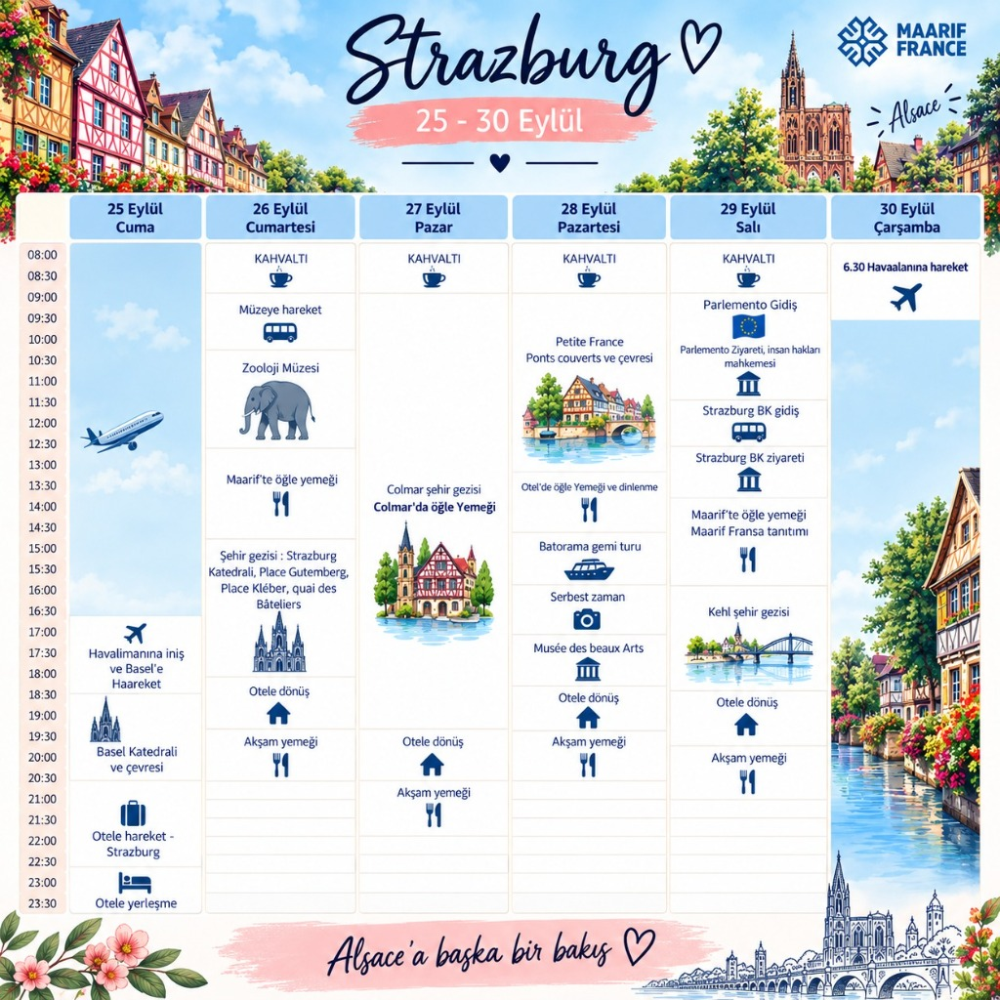

# 📅 Maarif France & GSB Strazburg - Alsace Gençlik Değişimi Programı 2026
### *25 - 30 Eylül 2026 | "Alsace'a Başka Bir Bakış"*

  

## 📌 Genel Bakış ve Heyet Bilgisi
**T.C. Gençlik ve Spor Bakanlığı (GSB)** ve **Türkiye Maarif Vakfı / Maarif France** iş birliğinde düzenlenen 2026 Strazburg & Alsace Gençlik Değişimi Programı; gençlik delegasyonunun Avrupa'nın kalbi olan Strazburg, Alsace bölgesi ve komşu sınır şehirlerinde kültürel, diplomatik, kurumsal ve tarihi incelemelerde bulunmasını hedefler.

---

## 🗓️ Günlük Program Özeti

| Gün & Tarih | Saatler | Ana Faaliyetler & Ziyaret Noktaları |
| :--- | :--- | :--- |
| **1. Gün (25 Eylül Cuma)** | 12:00 – 23:30 | Türkiye'den Uçuş ✈️, Basel-Mulhouse Havalimanına İniş, Basel Katedrali ve Çevresi, Strazburg'a İntikal ve Otele Yerleşme |
| **2. Gün (26 Eylül Cumartesi)** | 08:00 – 21:00 | Kahvaltı, Strazburg Zooloji Müzesi (*Musée Zoologique*), Maarif France Merkezinde Öğle Yemeği, Tarihi Şehir Gezisi (Strazburg Katedrali, Place Gutenberg, Place Kléber, Quai des Bâteliers), Akşam Yemeği |
| **3. Gün (27 Eylül Pazar)** | 08:00 – 22:00 | Kahvaltı, Colmar Şehir Gezisi, *Petite Venise* (Küçük Venedik), Colmar'da Öğle Yemeği, Alsace Ahşap Mimari & Kültürel İnceleme, Otele Dönüş ve Akşam Yemeği |
| **4. Gün (28 Eylül Pazartesi)** | 08:00 – 21:00 | Kahvaltı, *Petite France* & *Ponts Couverts* (Kapalı Köprüler), Otelde Öğle Yemeği ve Dinlenme, Batorama İll Nehri Gemi Turu, Serbest Zaman, *Musée des Beaux-Arts* (Güzel Sanatlar Müzesi), Akşam Yemeği |
| **5. Gün (29 Eylül Salı)** | 08:00 – 21:00 | Kahvaltı, Avrupa Parlamentosu & Avrupa İnsan Hakları Mahkemesi (AİHM) Ziyareti, T.C. Strazburg Başkonsolosluğu Ziyareti, Maarif France Öğle Yemeği & Maarif Fransa Tanıtımı, Kehl (Almanya) Şehir Gezisi & Ren Nehri Köprüsü, Akşam Yemeği |
| **6. Gün (30 Eylül Çarşamba)** | 06:30 – 14:00 | Sabah 06:30 Havalimanına Hareket ✈️ ve Türkiye'ye Dönüş |

---

## 📂 Günlük Rapor Dosyaları:
- [1. Gün (25 Eylül Cuma): Basel Varış & Strazburg İntikali](day-01-basel-arrival-strasbourg.md)
- [2. Gün (26 Eylül Cumartesi): Zooloji Müzesi, Maarif France & Katedral Gezisi](day-02-zoology-maarif-strasbourg-cathedral.md)
- [3. Gün (27 Eylül Pazar): Colmar & Alsace Kültürel Mirası](day-03-colmar-alsace-heritage.md)
- [4. Gün (28 Eylül Pazartesi): Petite France, Batorama Gemi Turu & Güzel Sanatlar Müzesi](day-04-petite-france-batorama-beaux-arts.md)
- [5. Gün (29 Eylül Salı): Avrupa Parlamentosu, AİHM, T.C. Strazburg Başkonsolosluğu, Maarif & Kehl Gezisi](day-05-eu-parliament-echr-consulate-maarif-kehl.md)
- [6. Gün (30 Eylül Çarşamba): Havalimanına Hareket ve Dönüş](day-06-departure-return.md)
