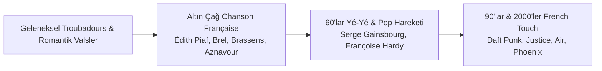

# 🎬 Fransız Sineması, Tiyatrosu ve Müzik Tarihi
### *Histoire du Cinéma Français, Théâtre de l'Absurde et Chanson Française*

> *"Le cinéma, c'est vingt-quatre fois la vérité par seconde."*  
> — **Jean-Luc Godard**  
> *(Sinema, saniyede yirmi dört kare hakikattir.)*

Fransa; sinemanın beşiği olmasının yanı sıra, Molière ve Racine'in klasik tiyatrosundan Samuel Beckett ve Eugène Ionesco'nun Absürd Tiyatrosuna, Édith Piaf'ın hüzünlü melodilerinden Daft Punk'ın küresel elektronik devrimine (*French Touch*) kadar sahne ve ses sanatlarında öncüdür.

---

## 1. Fransız Sinemasının Dönüm Noktaları

### A. Sinemanın Doğuşu: Lumière Kardeşler (1895)
* 28 Aralık 1895 tarihinde Paris Grand Café'de **Auguste ve Louis Lumière** tarafından ilk halka açık biletli gösterim yapıldı.
* İlk filmler: *La Sortie de l'usine Lumière à Lyon* (Lumière Fabrikasından Çıkan İşçiler) ve *L'Arrivée d'un train en gare de La Ciotat* (Trene Yolcuların Binişi).
* **Georges Méliès:** Sinemayı salt belgesel kaydından çıkarıp kurgu, efekt ve hayal gücüne taşıyan dahi yönetmen: *Le Voyage dans la Lune* (Aya Seyahat - 1902).

### B. Şiirsel Gerçekçilik (*Réalisme Poétique* - 1930'lar)
* 1930'lar Paris'inin sisli sokaklarını, işçi sınıfının trajik aşklarını ve yaklaşan 2. Dünya Savaşı'nın karamsarlığını işleyen sinema.
* **Yönetmenler & Başyapıtlar:** Jean Renoir (*La Grande Illusion*, *La Règle du jeu*), Marcel Carné (*Les Enfants du paradis - Cennetin Çocukları*, *Le Quai des brumes*).

### C. Fransız Yeni Dalgası (*La Nouvelle Vague* - 1958–1968)
* *Cahiers du Cinéma* dergisi etrafında toplanan genç sinema eleştirmenlerinin (Truffaut, Godard, Rohmer, Rivette, Chabrol) başlattığı devrim.
* **Öncü İlkeler:**
  1. **Auteur Yönetmen:** Yönetmen filmin sadece teknik yöneticisi değil, romancı gibi asıl yazarı ve yaratıcısıdır.
  2. **Doğal Çevre ve Sokak:** Stüdyolardan çıkıp Paris sokaklarına inmek; hafif kameralar ve doğal ortam ışığı.
  3. **Yenilikçi Kurgu:** Doğrusal zamanı kıran atlamalı kurgu (*jump cut*) ve seyirciye film izlediğini hatırlatan yabancılaştırma.
* **Kilit Filmler:**
  * Jean-Luc Godard: *À bout de souffle* (Serseri Aşıklar - 1960), *Le Mépris* (Nefret - 1963), *Pierrot le Fou* (1965).
  * François Truffaut: *Les Quatre Cents Coups* (400 Darbe - 1959), *Jules et Jim* (1962).
  * Agnès Varda (*Rive Gauche* kanadı): *Cléo de 5 à 7* (5'ten 7'ye Cléo - 1962).

---

## 2. Fransız Tiyatrosu: Klasisizmden Absürd Tiyatroya

### A. Klasik Fransız Tiyatrosu ve *Comédie-Française* (17. Yüzyıl)
* 1680'de XIV. Louis tarafından kurulan **Comédie-Française** (Molière'in Evi), dünyanın en köklü devlet tiyatrosudur.
* **Molière:** Toplumsal ikiyüzlülüğü, dini istismarı ve cehaleti yeren komedyalar (*Tartuffe, Le Misanthrope*).
* **Jean Racine & Pierre Corneille:** İnsan ihtirasları ile görev ahlakı arasındaki trajediler (*Phèdre, Andromaque, Le Cid*).

### B. Uyumsuz / Saçma Tiyatrosu (*Le Théâtre de l'Absurde* - 1950'ler)
2. Dünya Savaşı ve Hiroşima sonrası insanın evrendeki anlamsızlığını, iletişimsizliğini ve varoluşsal çıkmazını sahneye taşıyan avangard tiyatro:
* **Samuel Beckett (1906–1989):** *En attendant Godot* (Godot'yu Beklerken - 1952). Hiçbir zaman gelmeyecek olan kurtarıcı bir figürü bekleyen iki insanın absürd diyalogları.
* **Eugène Ionesco (1909–1994):** *La Cantatrice chauve* (Kel Şarkıcı - 1950), *Rhinocéros* (Gergedanlar). Totaliter ideolojilerin toplumu nasıl birer canavara dönüştürdüğünün hicvi.

---

## 3. Fransız Müzik Mirası: Chanson'dan French Touch'a

### A. La Chanson Française (Büyük Fransız Şarkı Geleneği)
Sözlerin şiirsel değer taşıdığı, akustik akordeon, piyano ve yaylılarla desteklenen edebi şarkı türü:
* **Édith Piaf ("La Môme"):** Paris sokaklarından dünya sahnelerine yükselen ses: *La Vie en rose*, *Non, je ne regrette rien*, *Hymne à l'amour*.
* **Jacques Brel:** Tiyatro gibi şarkı söyleyen Belçika kökenli büyük usta: *Ne me quitte pas*, *Amsterdam*.
* **Charles Aznavour:** Fransa ile dünya arasında kültür elçisi: *La Bohème*, *Hier encore*.
* **Serge Gainsbourg:** Provokatif, caz ve pop füzyonunun dahi söz yazarı: *Je t'aime... moi non plus*, *La Javanaise*.

### B. French Touch (Fransız Elektronik Müzik Devrimi)
1990'ların ortasında Paris'te doğan; disko sample'ları, filtreli bas hatları ve fütüristik synthesizer melodilerini birleştiren küresel fenomen:
* **Daft Punk (Thomas Bangalter & Guy-Manuel de Homem-Christo):** *Homework* (1997), *Discovery* (2001), *Random Access Memories* (2013 - Grammy Yılın Albümü).
* **Justice, Air, Kavinsky, Cassius, Phoenix.**
