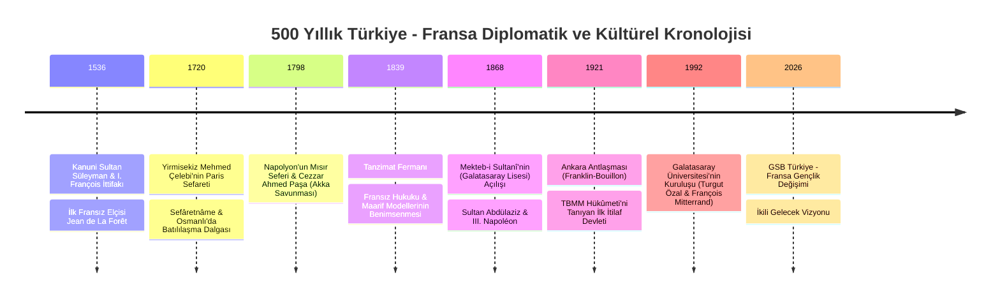

# 🇹🇷🤝🇫🇷 Türkiye - Fransa İlişkileri: 500 Yıllık Diplomasi, Kültür ve Düşünce Köprüsü

> *"Fransız kültürü bizim için Batı'ya açılan ilk ve en geniş pencere olmuştur. Tanzimat'tan bugüne kadar edebiyatımız, düşünce dünyamız ve idari kurumlarımız bu etkileşimle yoğrulmuştur."*  
> — **Cemil Meriç**, *Mağaradakiler*

Türkiye ile Fransa arasındaki diplomatik, kültürel ve felsefi ilişkiler, 16. yüzyılın başlarından günümüze uzanan beş asırlık kesintisiz ve çok katmanlı bir tarihe dayanır. Kanuni Sultan Süleyman ile I. François arasındaki ilk ittifaktan Tanzimat aydınlarına, Galatasaray Mekteb-i Sultanîsi'nden modern dönem gençlik ve teknoloji iş birliklerine kadar uzanan bu külliyat, iki köklü Akdeniz ve Avrupa gücünün ortak hafızasını temsil eder.

---

## 🏛️ 1. Tarihsel Dönüm Noktaları Kronolojisi (1536 - 2026)

---

## 📜 2. Klasik Dönem: İttifaktan Doğu Bilimine (16. - 18. Yüzyıl)

### 1536 İttifakı ve Kapitülasyonlar (*Alliance franco-ottomane*)
* Habsburg İmparatoru V. Karl'a (Şarlken) karşı esir düşen Fransa Kralı I. François'nın yardım talebi üzerine Kanuni Sultan Süleyman ile diplomatik ittifak tesis edildi.
* Bu ittifak, Avrupa güç dengesini kökten değiştirdi ve Fransız tüccarlara Levant (Doğu Akdeniz) limanlarında serbest ticaret hakkı tanıdı.

### Yirmisekiz Mehmed Çelebi'nin Paris Sefareti (1720)
* Sultan III. Ahmed tarafından Fransa Kralı XV. Louis'ye gönderilen elçi Mehmed Çelebi, Paris'in kütüphanelerini, rasathanelerini, saraylarını (Versailles) ve matbaalarını inceledi.
* Yazdığı **Paris Sefâretnâmesi**, Lale Devri ıslahatlarının ve İbrahim Müteferrika'nın ilk resmi Türk matbaasını kurmasının en büyük ilham kaynağı oldu.

---

## ✍️ 3. Edebi ve Felsefi Etkileşim: Tanzimat'tan Cumhuriyet'e

Türk modernleşmesi ve edebiyatı, 19. yüzyıldan itibaren Fransız Aydınlanması ve edebi akımlarıyla şekillendi:

| Türk Düşünürü / Şairi | Fransız Etkisi ve Esin Kaynağı | Yansıması & Eserleri |
| :--- | :--- | :--- |
| **Şinasi (1826-1871)** | Ernest Renan, Lamartine, Jean Racine | *Tercüme-i Manzume*, ilk tiyatro eseri (*Şair Evlenmesi*), noktalama işaretlerinin Türkçeye kazandırılması |
| **Namık Kemal (1840-1888)** | Jean-Jacques Rousseau, Montesquieu, Victor Hugo | *Hürriyet Kasidesi*, "Vatan", "Hürriyet" ve "Hukuk" kavramlarının Türk siyasetine girmesi |
| **Tevfik Fikret (1867-1915)** | François Coppée, Sully Prudhomme, Parnasizm | *Rübab-ı Şikeste*, *Halûk'un Defteri*, biçim mükemmeliyeti ve hümanist düşünce |
| **Ahmet Haşim (1887-1933)** | Stéphane Mallarmé, Paul Verlaine, Sembolizm | *Göl Saatleri*, *Piyâle*, saf şiir (*poésie pure*) ve empresyonist imgeler |
| **Yahya Kemal Beyatlı (1884-1958)** | Albert Sorel (Sorbonne), Charles Maurras, Heredia | Tarih şuuru, neo-klasisizm, *Kendi Gök Kubbemiz*, "Fransız aklı ile Türk ruhunun terkibi" |
| **Cahit Sıtkı Tarancı (1910-1956)** | Paul Valéry, Charles Baudelaire | *Otuz Beş Yaş*, ölüm ve yaşama sevinci temaları, hece vezninde Fransız lirizmi |
| **Cemil Meriç (1916-1987)** | Victor Hugo, Honoré de Balzac, Saint-Simon | Hugo'nun romanlarının çevirileri, *Kırk Ambar*, Doğu-Batı sentezi ve Fransız sosyoloji tahlilleri |

---

## 🎓 4. Ortak Eğitim ve Kültür Kurumları

Türkiye'de Frankofon kültür ve eğitimin en önemli kaleleri:

1. **Galatasaray Lisesi (*Lycée de Galatasaray - Mekteb-i Sultanî*) (1868):**
   * Sultan Abdülaziz'in Fransa ziyareti sonrasında, Dışişleri Bakanı Fuad Paşa ve Fransız elçisi Bourée'nin iş birliğiyle kuruldu.
   * Laik, rasyonel ve Fransızca tedrisat yapan okul, Türk bürokrasisinin ve aydın sınıfının omurgasını oluşturdu.

2. **Galatasaray Üniversitesi (1992):**
   * Cumhurbaşkanı Turgut Özal ile Fransa Cumhurbaşkanı François Mitterrand tarafından imzalanan uluslararası anlaşmayla kurulan iki dilli devlet üniversitesi.

3. **Fransız Kültür Merkezleri (*Institut Français de Turquie*):**
   * İstanbul (Beyoğlu), Ankara ve İzmir şubeleriyle sanat sergileri, film festivalleri ve DELF/DALF dil sertifikasyonları sağlar.

---

## 🌍 5. Modern Çağ: Gençlik, Bilim ve Gelecek Vizyonu (2026)

GSB Türkiye - Fransa Gençlik Değişimi Programı; bu 500 yıllık birikimi 21. yüzyılın meydan okumalarına taşımaktadır:

* **Gençlik Diplomasisi:** Kültürel önyargıların yıkılması ve ortak Avrupa-Akdeniz gençlik ağlarının güçlendirilmesi.
* **Yeşil Dönüşüm ve İnovasyon:** Fransa'nın *Station F* ve *French Tech* ekosistemi ile Türkiye'nin *Bilişim Vadisi* ve *T3 Vakfı / Teknofest* gençlik girişimciliği arasında köprü kurulması.
* **Kültürel Mirasın Korunması:** UNESCO Dünya Mirası listesindeki ortak alanların sürdürülebilir yönetimi ve gençlerin bu alanda gönüllü projelere entegrasyonu.
