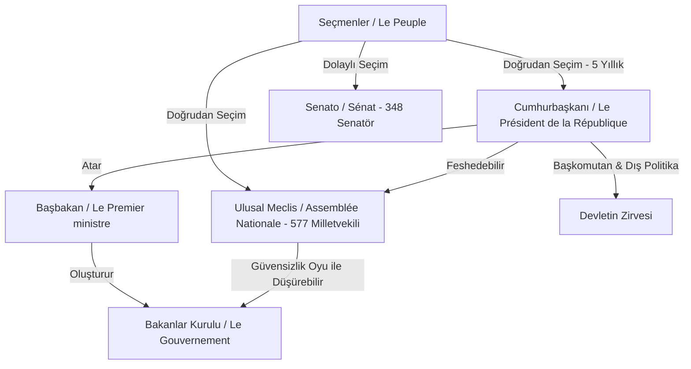

# 🏛️ Fransız Devlet Mimarisi, Anayasal Yapı ve Kamu Kurumları

> *"La France est une République indivisible, laïque, démocratique et sociale."*  
> — **Constitution de 1958, Article 1er**  
> *(Fransa; bölünmez, laik, demokratik ve sosyal bir Cumhuriyettir.)*

Fransa'nın devlet yapısı, güçlü bir merkeziyetçi bürokrasi geleneği ile cumhuriyetçi erdemlerin sentezine dayanır. Bu dosya; Beşinci Cumhuriyet'in anayasal mekanizmalarını, kamu hukuku organlarını, *Laïcité* ilkesini, ademi merkeziyetçilik süreçlerini ve gençlik politikaları kurumsal ağını (MJC, Service Civique vb.) ayrıntılarıyla inceler.

---

## 1. Beşinci Cumhuriyet (*La Ve République*) ve Yarı-Başkanlık Modeli

1958 yılında General Charles de Gaulle liderliğinde kabul edilen Anayasa ile kurulan 5. Cumhuriyet, yürütme organını parlamentoya karşı tahkim etmiştir.

### Temel Siyasi Aktörler ve Roller

* **Cumhurbaşkanı (*Le Président de la République* - Élysée Sarayı):**
  * Doğrudan halkoyuyla 5 yıllık (*Quinquennat*) süre için seçilir (en fazla üst üste 2 dönem).
  * Anayasanın ve cumhuriyetin sürekliliğinin garantörüdür.
  * Silahlı kuvvetlerin başkomutanıdır; nükleer caydırıcılık kodlarını elinde tutar.
  * Ulusal Meclis'i feshetme (*Dissolution*) yetkisine sahiptir.
  * 16. Madde uyarınca olağanüstü hal dönemlerinde istisnai yetkileri üstlenebilir.

* **Başbakan ve Hükûmet (*Matignon*):**
  * Hükûmetin çalışmalarını koordine eder, kanun tekliflerini hazırlar ve kamu idaresini yönetir.
  * Parlamentoya karşı sorumludur. Meclis çoğunluğu cumhurbaşkanının partisinden farklı olduğunda **"Cohabitation" (Birlikte Yaşama / Çift Başlı Yürütme)** dönemi yaşanır.

* **Çift Meclisli Parlamento (*Le Parlement*):**
  * **Ulusal Meclis (*Assemblée Nationale* - Palais Bourbon):** 577 milletvekili. Bütçe ve kanun yapımında son sözü söyler.
  * **Senato (*Sénat* - Palais du Luxembourg):** 348 senatör. Yerel yönetimlerin temsilcisi olarak görev yapar ve anayasa değişikliklerinde kilit role sahiptir.

---

## 2. Kilit Yargı ve Kamu Hukuku Organları

Fransa, kıta Avrupası kamu hukuku geleneğinin doğum yeridir:

### Anayasa Konseyi (*Conseil Constitutionnel*)
* Yasaların Anayasa'ya ve Temel Haklara uygunluğunu denetler (ön denetim ve *QPC - Question Prioritaire de Constitutionnalité* yoluyla sonradan denetim).
* Cumhurbaşkanlığı, parlamento seçimleri ve referandumların meşruiyetini onaylar.

### Danıştay (*Conseil d'État* - Palais-Royal)
* İki temel görevi vardır:
  1. Hükûmetin kanun ve kararname taslakları konusunda en yüksek hukuki danışma organıdır.
  2. İdari yargının en üst temyiz mahkemesidir (idarenin işlemlerini denetler).

### Sayıştay (*Cour des Comptes*)
* Kamu bütçesinin, bakanlık harcamalarının ve sosyal güvenlik fonlarının şeffaf ve hukuka uygun kullanımını denetler.

---

## 3. Fransız Tipi Laiklik İlkesi (*Laïcité*)

9 Aralık 1905 tarihli **"Kilise ve Devletin Ayrılması Yasası"** (*Loi de séparation des Églises et de l'État*), modern Fransa'nın kurucu anayasal ilkesidir:

1. **Kamu Hizmetinde Mutlak Tarafsızlık (*Neutralité de l'État*):** Devlet hiçbir dini tanımaz, finanse etmez veya maaşa bağlamaz. Kamu görevlileri görev başında dini sembol veya kanaat belirtemez.
2. **Vicdan ve İbadet Özgürlüğü (*Liberté de conscience*):** Her yurttaş inanma, inanmama, din değiştirme veya hiçbir dine inanmama özgürlüğüne sahiptir.
3. **Okullarda Laiklik:** Jules Ferry'den bu yana okullar, cumhuriyetçi eşitliğin ve tarafsız aklın geliştirildiği mekanlar olarak korunur (2004 tarihli kamusal okullarda dini sembol yasası).

---

## 4. İdari Yapı: Jakobenizmden Ademi Merkeziyetçiliğe (*Décentralisation*)

Tarihsel olarak Paris merkezli katı Jakoben bürokrasi, 1982 Gaston Defferre Yasaları ve 2003 Anayasa Reformu ile ademi merkeziyetçi bir esnekliğe kavuşmuştur:

| İdari Kademe | Sayı / Yapı | Temel Yetki Alanları |
| :--- | :--- | :--- |
| **Bölgeler (*Régions*)** | 13 Metropol + 5 Denizaşırı | Bölgesel ekonomik kalkınma, mesleki eğitim, liseler (*Lycées*), bölgesel ulaşım (TER trenleri) |
| **Departmanlar (*Départements*)** | 101 İl | Sosyal yardımlar, ortaokullar (*Collèges*), il yolları, kırsal kalkınma ve itfaiye |
| **Komünler / Belediyeler (*Communes*)** | ~35.000 Belediye | İmar planlaması, ilkokullar, yerel spor/kültür tesisleri, nüfus ve yerel asayiş |

---

## 5. Gençlik Politikaları Kurumsal Mimarisi

Fransa'da gençlik politikaları, devlet (Bakanlık), yerel yönetimler ve güçlü bir dernekler (*Association loi 1901*) ekosisteminin iş birliğiyle yürütülür:

### Gençlik ve Spor Bakanlığı (*Ministère des Sports, de la Jeunesse et de la Vie Associative*)
* Gençlik stratejilerini, yaygın eğitimi (*Éducation populaire*) ve gençlik hareketliliklerini finanse eder.

### Gençlik ve Kültür Evleri (*MJC - Maisons des Jeunes et de la Culture*)
* 1944 Kurtuluş döneminde kurulan ve bugün 1000'den fazla şubesi olan katılımcı gençlik merkezleridir.
* Gençlere sanat atölyeleri, tiyatro, spor, münazara kulüpleri ve demokratik katılım alanları sağlar.

### Yurttaşlık Hizmeti (*Service Civique*)
* 16-25 yaş arası gençlerin 6 ila 12 ay süreyle kamu yararına çalışan kurumlarda (eğitim, çevre, dayanışma, spor, kültür) aylık harçlık karşılığı gönüllü olarak görev yapmasını sağlayan ulusal program.

### Bilgi ve Dokümantasyon Merkezleri (*CIDJ & CRIJ*)
* Gençlere staj, istihdam, uluslararası hareketlilik, barınma ve haklar konusunda ücretsiz rehberlik sunan ağ.

---

## 📌 Türkiye ile Karşılaştırmalı Notlar

* **Merkezi İdare & Taşra:** Fransa'daki *Préfet* (Vali) sistemi ile Türkiye'deki mülki idare amirliği sistemi (Napolyon mirasından esinlenen) büyük benzerlik gösterir.
* **Gençlik Merkezleri:** Türkiye'de GSB Gençlik Merkezleri doğrudan bakanlık bünyesinde kamu eliyle işletilirken; Fransa'da MJC yapıları genellikle kamu destekli sivil dernekler (*Association loi 1901*) tarafından yönetilmektedir.
