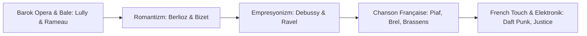

# 🎵 Fransa'nın Müzik Mirası: Barok Dönemden French Touch Devrimine

> *"La musique commence là où s'arrête le pouvoir des mots."*  
> — **Claude Debussy**  
> *(Müzik, sözcüklerin gücünün bittiği yerde başlar.)*

Fransız müzik geleneği; Versailles saraylarının debdebeli barok operasından 19. yüzyılın empresyonist armoni devrimine, Paris kafelerinin melankolik *Chanson* geleneğinden 21. yüzyılın küresel elektronik müzik akımı *French Touch*'a kadar uzanan benzersiz bir estetik yelpazeye sahiptir.

---

## 🎻 1. Barok ve Klasik Çağ: Versailles Sarayının İhtişamı

### Jean-Baptiste Lully (1632-1687) & Kraliyet Müziği
* XIV. Louis (Güneş Kral) döneminde Fransız operasının (*Tragédie en musique*) ve saray balesinin temellerini attı. Molière ile birlikte yarattığı *Comédie-ballet* türü (*Kibarık Budalası / Le Bourgeois gentilhomme*) müzik ve tiyatronun zirvesidir.

### Jean-Philippe Rameau (1683-1764) & Armoni Devrimi
* 1722 tarihli *Traité de l'harmonie* (Armoni İncelemesi) ile tonal müziğin ve modern akor teorisinin kurallarını sistemleştirdi. *Les Indes galantes* operası Barok dönemin en görkemli sahne yapıtlarındandır.

---

## 🎼 2. 19. ve 20. Yüzyıl: Romantizmden Empresyonizme

Fransız besteciler, Alman senfonik geleneğine karşı renk, tını ve atmosfer odaklı özgün bir dil geliştirdiler:

| Besteci | Başlıca Eserleri | Müzikal Üslup ve Katkısı |
| :--- | :--- | :--- |
| **Hector Berlioz (1803-1869)** | *Symphonie fantastique*, *La Damnation de Faust* | Orkestrasyon sanatının mucidi, programlı senfoni ve romantik coşku |
| **Georges Bizet (1838-1875)** | *Carmen*, *L'Arlésienne* | Dünya opera tarihinin en çok sahnelenen başyapıtı *Carmen*; İspanyol ritimleri ve gerçekçi dram |
| **Camille Saint-Saëns (1835-1921)** | *Le Carnaval des animaux*, *Samson et Dalila*, *Danse macabre* | Fransız klasik zarafeti, kusursuz teknik ve enstrümantal ustalık |
| **Claude Debussy (1862-1918)** | *Clair de lune*, *La Mer*, *Prélude à l'après-midi d'un faune* | Müzikte Empresyonizm'in kurucusu; gamlar, modlar ve rüya gibi tını blokları |
| **Maurice Ravel (1875-1937)** | *Boléro*, *Pavane pour une infante défunte*, *Daphnis et Chloé* | Orkestrasyon dehası, kusursuz saatçi titizliği, İspanyol ve caz motifleri |
| **Erik Satie (1866-1925)** | *Gymnopédies*, *Gnossiennes* | Minimalizm ve ambiyans müziğinin öncüsü; sade, absürt ve duru melodiler |

---

## 🎙️ 3. Fransız Şarkı Geleneği: *La Chanson Française*

Fransız Chanson'u, sözlerin edebiyatla, sesin ise derin bir varoluşsal duyguyla buluştuğu eşsiz bir türdür:

* **Édith Piaf ("La Môme") (1915-1963):**
  * *La Vie en rose*, *Non, je ne regrette rien*, *Hymne à l'amour*, *Milord*.
  * Paris sokaklarından dünya sahnelerine uzanan, acı, aşk ve boyun eğmezlik dolu efsanevi ses.

* **Jacques Brel (1929-1978):**
  * *Ne me quitte pas*, *Amsterdam*, *Quand on n'a que l'amour*.
  * Şiirsel anlatım, teatral sahne performansı ve insan ruhunun derinliklerine inen lirizm.

* **Georges Brassens (1921-1981):**
  * *Les Passantes*, *Chanson pour l'Auvergnat*.
  * Gitarı ve anarşist-hümanist şiirleriyle Fransız dilinin en saf ozanı.

* **Charles Aznavour (1924-2018):**
  * *La Bohème*, *Emmenez-moi*, *Hier encore*.
  * Dünya çapında 180 milyondan fazla albüm satan, 20. yüzyılın en büyük şanson şairlerinden biri.

* **Serge Gainsbourg (1928-1991):**
  * *Je t'aime... moi non plus*, *Bonnie and Clyde*, *Histoire de Melody Nelson*.
  * Fransız pop müziğinin provokatif dâhisi; caz, reggae ve elektronik müziği harmanlayan vizyoner.

---

## 🎧 4. Elektronik Devrim ve Küresel Başarı: *French Touch*

1990'ların ortasında Paris ve Versailles banliyölerinde doğan **French Touch** (Fransız Dokunuşu) akımı, disko sample'larını house ritimleri ve synthesizer'larla harmanlayarak dünya dans müziğini yeniden tanımladı:

* **Jean-Michel Jarre (1948-):** *Oxygène* (1976) ve *Équinoxe* ile elektronik senfoni ve mega açık hava lazer konserlerinin öncüsü.
* **Daft Punk (Guy-Manuel de Homem-Christo & Thomas Bangalter):**
  * *Homework* (1997), *Discovery* (2001), *Random Access Memories* (2013) - 5 Grammy ödülü.
  * *Around the World*, *One More Time*, *Get Lucky* ile müzik tarihinin en ikonik ikilisi.
* **Justice, Air, Cassius, Phoenix, Kavinsky, Laurent Garnier:**
  * Fransız estetiğini küresel indie, synthwave ve kulüp kültürünün merkezine taşıyan uluslararası sanatçılar.

---

## 🌍 5. Müzik Bayramı: *Fête de la Musique* (21 Haziran)

1982 yılında Kültür Bakanı Jack Lang ve besteci Maurice Fleuret tarafından başlatılan **Fête de la Musique**:
* Her yıl 21 Haziran (yaz gündönümü) günü, Fransa'nın tüm sokaklarında, meydanlarında, parklarında ve kafelerinde amatör-profesyonel tüm müzisyenlerin ücretsiz konser verdiği bir halk bayramıdır.
* Bugün dünya çapında 120'den fazla ülkede resmi olarak kutlanmaktadır.
